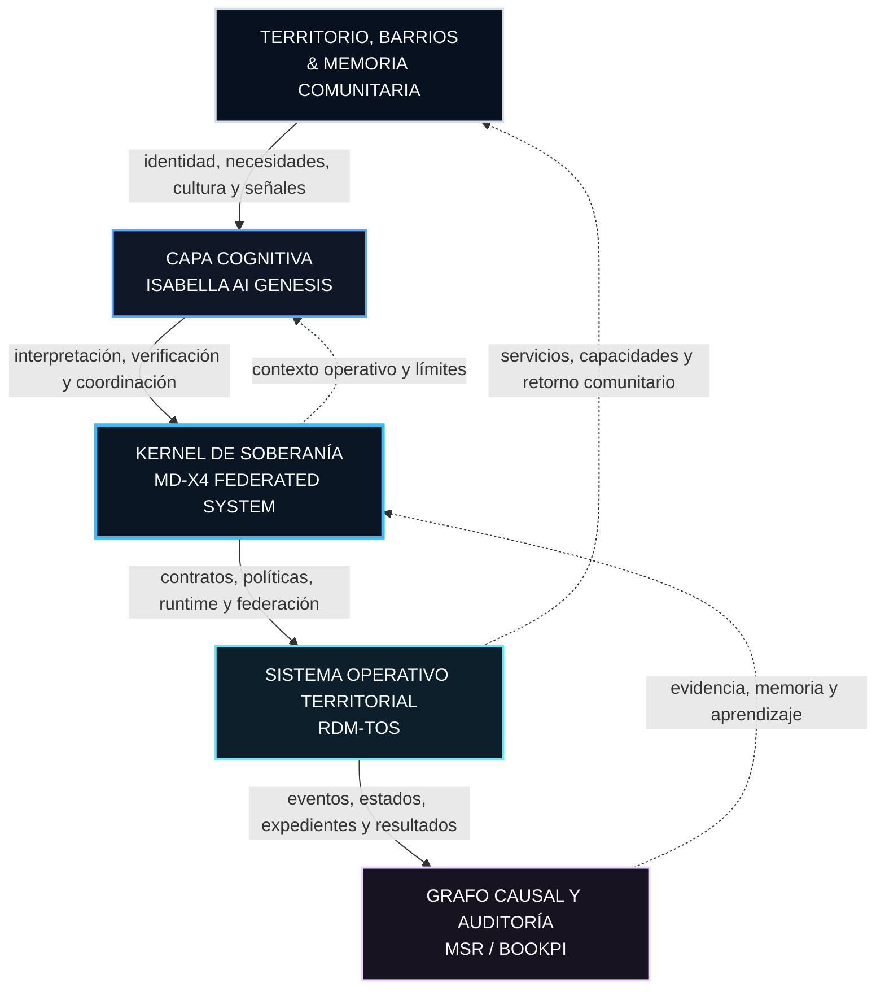

# TAMV ONLINE ENTERPRISE
## Infraestructura Civilizatoria, Soberanía Digital e Inteligencia Territorial

[](https://github.com/TAMV-ONLINE)
[](docs/ARCHITECTURE.md)
[](docs/ISABELLA.md)
[](docs/BOOKPI.md)
[](https://github.com/TAMV-ONLINE)

---

> **No construyo una marca. Construyo una infraestructura civilizatoria.**
>
> **No somos el futuro: somos la fuerza del presente que ha despertado desde Latinoamérica.**

**TAMV ONLINE ENTERPRISE** es un ecosistema tecnológico de raíz territorial, fundado y consolidado en **Mineral del Monte (Real del Monte), Hidalgo, México**, orientado al diseño, despliegue, auditoría y preservación de infraestructura digital soberana, memoria histórica operacional, inteligencia artificial gobernada y coordinación comunitaria autónoma.

No es un portafolio. No es un hobby. No es una vitrina tecnológica superficial. Es un **sistema vivo, operativo, resiliente y observable**, diseñado para articular soberanía digital y capacidad técnica real desde México hacia América Latina.

> Las expresiones "autocurativo" e "inalterable" se utilizan aquí como objetivos arquitectónicos: el sistema debe detectar, contener y reparar fallas bajo reglas verificables; los registros deben preservar integridad mediante controles de acceso, versionado, hashes y auditoría. Ninguna propiedad de seguridad se considera absoluta sin evidencia técnica.

---

## Origen, dedicación y propósito

TAMV nace desde un territorio concreto y desde una experiencia concreta: la de una comunidad que trabaja, resuelve, emprende, crea e innova diariamente para sostener la vida.

Es un proyecto dedicado:

- A los barrios.
- A las raíces históricas.
- A la memoria local.
- A comerciantes y familias trabajadoras.
- A quienes innovan sin recibir reconocimiento formal.
- A quienes luchan cada día por llevar comida a sus mesas.
- A quienes construyen soluciones con recursos limitados.
- A quienes desean participar en el futuro digital sin renunciar a su identidad.

Por eso, TAMV es **orgullosamente realmontense**. No como una etiqueta publicitaria, sino como una declaración de origen, responsabilidad y criterio.

> **La tecnología de TAMV debe responder ante el territorio que la inspira y ante las comunidades que pretende servir.**

Durante más de cuatro décadas se sostuvo que nuestras latitudes estaban confinadas a la condición de consumidoras pasivas, usuarias finales o receptoras de arquitecturas diseñadas en otros centros de poder. TAMV responde construyendo capacidad propia: no desde la imitación, sino desde la investigación, la documentación, la ingeniería y la colaboración territorial.

---

## I. Declaración de soberanía, liderazgo y propósito

El rechazo institucional o mercantil no destruye la visión: la vuelve más rigurosa, auditable y exigente. TAMV no reclama legitimidad por su retórica, sino por la capacidad de convertir principios en sistemas operativos, contratos verificables, documentación, pruebas, despliegues y servicios útiles.

### Criterio de autonomía

La tecnología producida por TAMV rinde cuentas ante el territorio que la inspira. Si un sistema no genera capacidad real, autonomía operativa, viabilidad comunitaria o memoria técnica accesible, carece de legitimidad dentro del ecosistema.

### Dedicatoria operativa

La arquitectura se orienta a las personas y comunidades que sostienen la vida cotidiana mediante trabajo, cooperación, comercio, aprendizaje e innovación práctica.

### Compromiso de diseño

TAMV no convierte la comunidad en una fuente pasiva de datos. Busca construir herramientas mediante las cuales el territorio pueda comprender, gobernar, preservar y utilizar sus propios activos digitales.

---

## II. Tesis fundamental y pregunta de investigación

> **Si la tecnología no fortalece a la comunidad, solo está decorando dependencia.**

### Los cinco axiomas del ecosistema

1. **Soberanía de datos.** Si los datos no conservan soberanía en su lugar de origen, la memoria colectiva se degrada en extractivismo digital.
2. **Inteligencia territorial.** Si la inteligencia artificial no sirve a las dinámicas vivas del territorio, se convierte en ruido sintético automatizado.
3. **Resiliencia operativa.** Si un sistema no puede sobrevivir, degradarse con elegancia y recuperarse de sus fallas, no ha alcanzado madurez arquitectónica.
4. **Trazabilidad causal.** Si una decisión técnica o algorítmica no puede reconstruirse punto por punto, la infraestructura carece de memoria.
5. **Autonomía cognitiva.** Si una comunidad no puede auditar, comprender ni cuestionar el código que influye en su entorno, la tecnología reproduce subordinación.

### Pregunta arquitectónica central

> **¿Cómo se diseña una plataforma que piense como territorio, resista como sistema y evolucione como organismo?**

Esta interrogante guía la especificación del kernel, la jerarquía de almacenamiento, la gobernanza algorítmica, la observabilidad distribuida y el equilibrio entre automatización e inteligencia humana.

---

## III. Topología de arquitectura ecosistémica



---

## IV. Módulos principales y matriz de runtime

| Componente | Capa arquitectónica | Función táctica y operativa | Estado runtime |
|---|---|---|---|
| **MD-X4** | Kernel / Federación | Coordinación de nodos federados, contratos API, políticas, orquestación y control de fallos. | `Active` |
| **RDM-TOS** | Sistema operativo territorial | Gestión de datos contextuales, expedientes, eventos, alertas y memoria operacional local. | `Active` |
| **Isabella AI** | Cognición / Agentes | IA gobernada, recuperación contextual, resolución de incertidumbre, procedencia y skills. | `Genesis` |
| **MSR / BookPI** | Memoria / Auditoría | Grafo de trazabilidad que relaciona decisiones, código, evidencia, pruebas y despliegues. | `Active` |
| **TAMV Network** | Interfaz / Red | Interacción pública, servicios federados, experiencias XR/multimedia y colaboración. | `Active` |

Los estados son etiquetas operativas y deben actualizarse únicamente con evidencia: releases, pruebas, documentación, despliegues o registros BookPI.

### 1. MD-X4 — Kernel de soberanía y federación

MD-X4 es el centro de orquestación, contrato y ejecución soberana del ecosistema.

Responsabilidades:

- Firmar, versionar y validar contratos de datos e interfaces intermodulares.
- Federar nodos con límites de aislamiento de fallos.
- Controlar migraciones y compatibilidad.
- Mitigar regresiones arquitectónicas.
- Aplicar políticas de soberanía antes de transmitir datos.
- Coordinar reintentos, timeouts, circuit breakers y recuperación.

### 2. RDM-TOS — Sistema operativo territorial

RDM-TOS traduce flujos sociales, económicos, culturales y operativos en memoria estructural sin descontextualizarlos.

Capacidades:

- Administración de casos, expedientes y eventos.
- Gestión de flujos de datos y alertas.
- Registro de dinámicas económicas locales y servicios comunitarios.
- Políticas de acceso basadas en roles, contexto y gobernanza.
- Versionado, retención y preservación de datos.

### 3. Isabella AI — Capa cognitiva gobernada

Isabella AI no opera como oráculo de caja negra ni como agente extractivo. Es una capa federada de inteligencia gobernada con límites explícitos.

Directivas:

- **Transparencia de contexto:** declara la información utilizada, fuentes consultadas y nivel de incertidumbre.
- **Control de herramientas:** toda ejecución de código o invocación externa queda registrada con procedencia.
- **Aislamiento de prompts:** las instrucciones del sistema se separan de entradas de usuario y contenido externo.
- **Escalamiento humano:** las acciones sensibles requieren autorización humana.
- **Revisión:** el resultado debe poder ser evaluado, corregido y, cuando sea necesario, rechazado.

### 4. MSR / BookPI — Memoria causal

BookPI preserva la memoria técnica y evita la improvisación operativa.

```text
Decisión ↔ Cambio ↔ Código ↔ Evidencia ↔ Despliegue ↔ Resultado
```

Debe registrar:

- Decisiones de arquitectura.
- Cambios de contratos.
- Incidentes y causa raíz.
- Riesgos aceptados.
- Pruebas.
- Rollbacks.
- Dependencias.
- Resultados de validación.

### 5. TAMV Online Network — Interfaz y presencia pública

Es la superficie de contacto pública, colaborativa y comunitaria.

Integra:

- Repositorios.
- Documentación.
- Aplicaciones web y XR.
- Experiencias multimedia.
- Radio comunitaria.
- Servicios económicos.
- Nodos de trabajo.
- Canales de colaboración.

---

## V. Matriz de defensa y análisis causal de fallas

TAMV rechaza los parches cosméticos. Todo error en cualquier nodo, servicio o repositorio debe someterse a una investigación causal completa:

```text
Condición previa
      ↓
Disparador
      ↓
Vulnerabilidad
      ↓
Error observable
      ↓
Impacto
      ↓
Detección
      ↓
Contención
      ↓
Corrección
      ↓
Verificación
      ↓
Aprendizaje
```

### Capas integradas de resiliencia

```text
[ PREVENCIÓN ]
Tipado estricto, contratos versionados, validación de esquemas y límites de entrada.
        │
        ▼
[ DETECCIÓN ]
Health checks, pruebas sintéticas, métricas doradas, logs y alertas.
        │
        ▼
[ CONTENCIÓN ]
Circuit breakers, aislamiento de recursos, timeouts y degradación elegante.
        │
        ▼
[ CORRECCIÓN ]
Rollback, reconciliación, reintentos idempotentes y backoff exponencial.
        │
        ▼
[ APRENDIZAJE ]
Registro BookPI y prueba de no regresión obligatoria.
```

Una corrección no se considera completa hasta que:

- Se identifica el disparador.
- Se registra la causa raíz.
- Se protege el sistema contra la repetición.
- Se define cómo se detectará una recaída.
- Se conserva evidencia de la validación.

---

## VI. Gobernanza técnica y normas de desarrollo

### Niveles de versionado

- **PATCH (`x.x.N`):** correcciones internas sin modificación de contratos API ni esquemas.
- **MINOR (`x.N.0`):** capacidades, endpoints o skills compatibles hacia atrás.
- **MAJOR (`N.0.0`):** alteraciones incompatibles en APIs, esquemas RDM-TOS, kernel o protocolos. Requiere BookPI.
- **HOTFIX / EMERGENCY:** respuesta prioritaria ante vulnerabilidad o incidente crítico. Exige análisis post-mortem documentado en un plazo máximo de 72 horas, salvo que las condiciones del incidente exijan otro plazo documentado.

### Reglas de integración

1. **Verificación estricta:** ningún Pull Request crítico se integra sin completar CI/CD, linting, tests unitarios, tests de contrato, revisión de seguridad e inspección de secretos.
2. **Prohibición de parches ciegos:** se rechazan cambios que oculten errores o resuelvan síntomas sin documentar disparador y causa raíz.
3. **Human-in-the-loop:** borrado masivo, cambios de permisos, reconfiguración de infraestructura, operaciones económicas y publicaciones irreversibles requieren autorización humana explícita.
4. **Cambios reversibles:** todo despliegue debe incluir rollback o una estrategia equivalente de recuperación.
5. **Cambios observables:** toda modificación que pueda alterar el comportamiento debe producir señales verificables.
6. **Contratos primero:** cualquier cambio de esquema o API debe actualizar sus consumidores, validadores y documentación.

### Gobernanza algorítmica

Isabella AI debe registrar, según el nivel de sensibilidad:

- Contexto utilizado.
- Fuentes recuperadas.
- Herramientas invocadas.
- Nivel de incertidumbre.
- Resultado producido.
- Reglas aplicadas.
- Revisión o aprobación humana.

Las entradas externas se consideran no confiables hasta ser validadas. Las directivas del sistema, los documentos recuperados y los datos de usuario deben permanecer aislados por diseño.

---

## VII. Estructura canónica de repositorios y documentación

```text
docs/
├── ARCHITECTURE.md       # Diagramas y topología de componentes
├── ISABELLA.md           # Especificación de IA gobernada y agentes
├── GOVERNANCE.md         # Versionado, PRs y políticas de merge
├── CONTRIBUTING.md       # Guía de contribución y compromiso territorial
├── SECURITY.md           # Secretos, cifrado y vectores de ataque
├── BOOKPI.md             # Registro de decisiones y cambios
├── CHANGE_MANAGEMENT.md  # Despliegue, migraciones y rollback
├── OPERATIONS.md         # Observabilidad y recuperación de desastres
├── RUNBOOKS/             # Resolución paso a paso de incidentes
├── decisions/            # Decisiones BPI-YYYY-XXXX
└── contracts/            # OpenAPI, GraphQL, Protobuf y JSON Schema
```

Cada repositorio debe declarar:

- Propósito.
- Alcance.
- Dependencias.
- Contratos consumidos.
- Contratos producidos.
- Nivel de madurez.
- Licencia.
- Estado de despliegue.
- Método de pruebas.
- Política de seguridad.
- Responsable o grupo mantenedor.

---

## VIII. Protocolo de contribución

Para contribuir a TAMV ONLINE ENTERPRISE, el desarrollador debe aportar criterio técnico y compromiso territorial, no solo líneas de código.

### Antes de modificar un módulo

1. Identificar los contratos que consume.
2. Identificar los contratos que produce.
3. Revisar dependencias y permisos.
4. Localizar métricas, logs y health checks.
5. Buscar decisiones BookPI relacionadas.
6. Reproducir el problema o validar la necesidad.
7. Definir impacto, pruebas y rollback.

### Flujo de trabajo

```text
Issue / RFC
   ↓
Análisis causal
   ↓
Branch temática
   ↓
Implementación
   ↓
Pruebas
   ↓
Revisión
   ↓
BookPI / documentación
   ↓
Merge
   ↓
Despliegue controlado
   ↓
Monitoreo
```

### Ramas recomendadas

```text
feature/
fix/
security/
audit/
docs/
experiment/
release/
```

### Todo Pull Request debe explicar

- Qué problema resuelve.
- Por qué existe.
- Qué cambió.
- Qué no cambió.
- Qué contratos fueron afectados.
- Qué riesgos introduce.
- Cómo se probó.
- Cómo se revierte.
- Qué documentación se actualizó.

---

## IX. Plantilla estándar de registro BookPI

Archivo recomendado: `docs/decisions/BPI-2026-XXXX.md`

```yaml
id: BPI-2026-0001
title: "Restauración y aislamiento del runtime federado de Isabella AI"
status: accepted
date: 2026-10-08

context:
  problem: "Saturación de latencia en la resolución de skills por falta de aislamiento del nodo."
  trigger: "Pico de peticiones concurrentes desde RDM-TOS."
  affected_components:
    - "MD-X4"
    - "Isabella AI"
    - "RDM-TOS"

decision:
  selected_option: "Circuit breakers aislados y colas de trabajo por prioridad."
  rationale: "Evita que la degradación cognitiva comprometa la integridad de datos territoriales."

risks:
  - description: "Mayor latencia temporal en solicitudes no prioritarias."
    mitigation: "Caché local, límites de concurrencia y monitoreo de cola."

validation:
  tests:
    - "Pruebas de carga sintética con 10000 peticiones concurrentes."
    - "Pruebas de aislamiento y recuperación."
  evidence:
    - "Logs de auditoría."
    - "Reporte de latencia de CI/CD."

rollback:
  procedure: "Revertir al commit documentado y desactivar el flag de federación activa."

links:
  issues: ["#104"]
  pull_requests: ["#212"]
  commits: ["b8f3a1e"]
```

---

## X. Seguridad, soberanía y operación

### Credenciales y secretos

- Nunca almacenar secretos en el repositorio.
- Usar gestores de secretos por entorno.
- Rotar tokens y credenciales.
- Aplicar privilegio mínimo.
- Auditar accesos.
- Ejecutar detección automática de secretos.

### Datos

- Clasificar datos por sensibilidad.
- Cifrar tránsito y almacenamiento.
- Definir retención y borrado.
- Probar backups y restauración.
- Separar datos públicos, internos y restringidos.
- Registrar accesos a información sensible.

### APIs y servicios

- Validar payloads en frontera.
- Aplicar autenticación y autorización.
- Implementar rate limiting.
- Limitar tamaños y tiempos.
- Usar operaciones idempotentes.
- Evitar filtrar detalles internos en errores.
- Registrar eventos de seguridad sin exponer PII innecesaria.

### Observabilidad

Todo servicio crítico debe responder:

- ¿Está vivo?
- ¿Está listo?
- ¿Está funcionando correctamente?
- ¿Se está degradando?
- ¿Puede recuperarse?
- ¿Está causando impacto?

Métricas mínimas:

- Disponibilidad.
- Latencia.
- Error rate.
- Saturación.
- Uso de recursos.
- Estado de dependencias.
- Calidad de resultados.
- Eventos de seguridad.

---

## XI. Identidad y posicionamiento

**Fundador y arquitecto principal:** Edwin Oswaldo Castillo Trejo  
**Nombre utilizado en el ecosistema:** Anubis Villaseñor  
**Origen:** Real del Monte, Hidalgo, México  
**Ámbito:** Latinoamérica hacia el mundo  
**Identidad territorial:** Orgullosamente realmontense

TAMV se presenta como una infraestructura de origen territorial, no como una promesa de superioridad automática. Su legitimidad debe construirse mediante evidencia técnica, utilidad comunitaria, documentación y capacidad de aprendizaje.

---

## XII. Declaración final

> Durante más de cuatro décadas se nos dijo que no podíamos. Durante más de cuatro décadas se afirmó que solamente éramos consumidores, usuarios finales o destinatarios de tecnologías diseñadas en otra parte.
>
> Hoy nos plantamos con firme convicción y sin miedo a proponer una nueva era digital.
>
> No desde la imitación.
>
> No desde la dependencia.
>
> No desde la necesidad de pedir permiso para imaginar.
>
> Nos plantamos desde el territorio, desde la memoria y desde el trabajo de quienes han sostenido sus comunidades aun cuando nadie los llamó innovadores.
>
> **TAMV ONLINE ENTERPRISE nace orgullosamente realmontense porque su origen no es una etiqueta publicitaria, sino una responsabilidad histórica.**
>
> Es la responsabilidad de construir tecnología que recuerde a quién sirve.
>
> Es la responsabilidad de demostrar que la inteligencia también puede surgir desde un barrio, una familia, un taller, una comunidad o una persona que decidió aprender por sí misma.
>
> Es la responsabilidad de convertir el conocimiento en capacidad, la memoria en infraestructura y la visión en sistemas que puedan resistir.
>
> **No somos el futuro. Somos la fuerza del presente que ha despertado desde Latinoamérica.**
>
> Si el código no sostiene la visión, se reescribe.
>
> Si la visión no resiste la realidad, se corrige.
>
> Si una decisión no puede explicarse, se documenta en BookPI.
>
> Si una falla se repite, no se emparcha indefinidamente: se transforma la arquitectura que la permitió.
>
> Si el territorio no gana autonomía, el proyecto todavía no termina.
>
> **Esto no es solamente desarrollo de software. Es memoria, soberanía, servicio y posicionamiento civilizatorio.**

---

## XIII. Estado del documento

Este archivo constituye la declaración arquitectónica, operativa y de gobernanza de TAMV ONLINE ENTERPRISE.

Las licencias de código, documentación, datos, marcas y artefactos se especifican por repositorio y componente. Las afirmaciones de estado deben actualizarse junto con evidencia técnica verificable: releases, pruebas, despliegues, auditorías o registros BookPI.

El proyecto está en evolución continua. Evolucionar no significa carecer de dirección: significa mantener la capacidad de corregir, documentar, aprender y construir sin perder el propósito territorial.

---

*Diseñado, codificado, auditado y sostenido desde Mineral del Monte —Real del Monte—, Hidalgo, México.*
