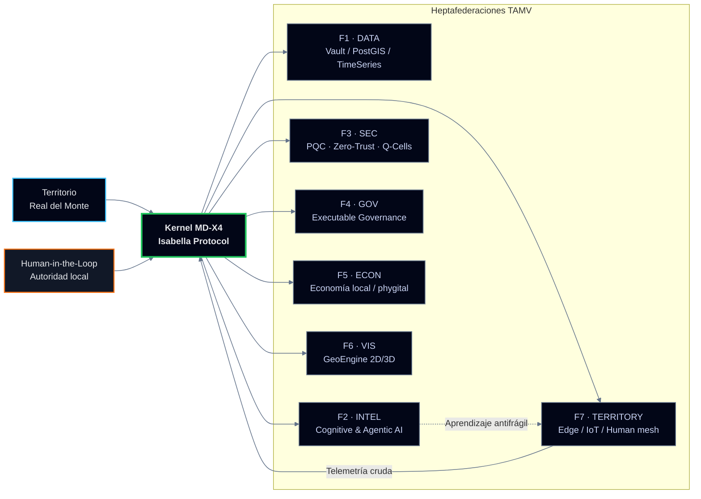

<div align="center">

<!-- Banner (puedes cambiar la URL cuando tengas tu asset real) -->


<br/><br/>

<h1 style="font-weight:700; letter-spacing:0.18em; text-transform:uppercase;">
TAMV ONLINE · ECOSISTEMA LATAM
</h1>
<h3 style="font-weight:400; color:#CBD5F5; margin-top:4px;">
MD‑X4 · RDM‑TOS · Inteligencia Nativa Extensible desde Real del Monte, México
</h3>

<br/>


<br/><br/>

<div style="
  max-width:920px;
  padding:18px 26px;
  border-radius:22px;
  border:1px solid rgba(148,163,184,0.55);
  background:
    radial-gradient(circle at 0% 0%, rgba(56,189,248,0.18), transparent 55%),
    radial-gradient(circle at 100% 100%, rgba(244,63,94,0.13), transparent 55%),
    linear-gradient(145deg, rgba(15,23,42,0.96), rgba(15,23,42,0.92));
  backdrop-filter: blur(18px);
  box-shadow:
    0 28px 80px rgba(0,0,0,0.85),
    0 0 0 1px rgba(15,23,42,0.95);
  text-align:left;
">
<p style="color:#E5E7EB; font-size:14px; line-height:1.7;">
<strong style="color:#38BDF8;">TAMV ONLINE</strong> (Tecnología Avanzada Mexicana Versátil) es un
Ecosistema Civilizatorio Federado nacido en México, diseñado para que territorios, creadores y
organizaciones de LATAM operen su propio sistema operativo digital en lugar de ser solo
infraestructura de datos para terceros.[web:229][web:231][web:239]
</p>
<p style="color:#9CA3AF; font-size:13px; margin-top:6px;">
Este espacio reúne la arquitectura MD‑X4, el Nodo Territorial <em>RDM‑TOS</em>, la Inteligencia Nativa
Extensible <em>Isabella IA</em> y el canon técnico‑académico asociado (ORCID · DOI · OpenAIRE).[web:229][web:232][web:193]
</p>
</div>

</div>

---

## 1. Quién soy

**Edwin Oswaldo Castillo Trejo · “Anubis Villaseñor”**  
Arquitecto de ecosistemas digitales, fundador de TAMV ONLINE y creador del modelo MD‑X4 / RDM‑TOS.[web:231][web:239][web:232]

- Ubicación: Real del Monte, Hidalgo, México (Nodo RDM‑TOS).[web:229]  
- Trayectoria: de la artesanía y el trabajo manual a la arquitectura de software, IA aplicada y sistemas territoriales soberanos.[web:231][web:239]  
- Registro académico:  
  - ORCID: https://orcid.org/0009-0008-5050-1539[web:193]  
  - DOI Canon TAMV: https://doi.org/10.5281/zenodo.19436662[web:229]  
  - OpenAIRE: https://explore.openaire.eu/my-orcid-links[web:193]  

**Perfiles oficiales:**

- 🌐 Sitio TAMV: https://tamvonline-odoo.com[web:229]  
- 📰 Blog técnico/narrativo: https://tamvonlinenetwork.blogspot.com[web:231][web:239]  
- 👥 Comunidad: https://groups.io/g/TAMVONLINE-ECOSISTEM-LATAM/topics  
- 🔗 LinkedIn: https://www.linkedin.com/in/edwin-oswaldo-castillo-aka-anubis-villaseñor-69a847376/[web:254]  
- 🐙 GitHub: https://github.com/OsoPanda1  

---

## 2. Qué es TAMV ONLINE

TAMV ONLINE es un **ecosistema digital civilizatorio** que conecta contenidos, experiencias inmersivas y servicios en línea en una misma infraestructura federada.[web:229][web:232]  

- Objetivo: ofrecer a LATAM un **sistema operativo civilizatorio** competitivo con infraestructuras globales, pero alineado a la dignidad humana, la soberanía de datos y el contexto territorial.[web:229][web:239]  
- Casos de uso: turismo inteligente, academias digitales, plataformas de contenido, metaverso productivo y servicios públicos digitales.[web:229][web:231][web:232]  

**Modelo de adopción y negocio (visión preliminar):**[web:229]  

- Adopción esperada LATAM: 1–3 % de mercado, equivalente a 500,000–1,500,000 usuarios activos.  
- ARPU estimado: 15–35 USD por usuario activo mensual (según vertical y nivel de servicio).  
- Punto de equilibrio: entre 8,500 y 12,000 usuarios activos mensuales.  

---

## 3. MD‑X4 · Kernel heptafederado

MD‑X4 es el **kernel de soberanía** que organiza el ecosistema en siete federaciones funcionales, con un modelo antifrágil y Zero‑Trust.[web:231][web:239][web:232]



**Propiedades clave:**  

- Heptafederado: ningún módulo es monolito; todo puede evolucionar sin romper el sistema.[web:231]  
- Human‑in‑the‑loop: decisiones civilizatorias siempre tienen responsable humano identificado.[web:239]  
- Seguridad: uso de criptografía post‑cuántica (PQC) y células lógicas autocurativas (Q‑Cells).[web:232]  

---

## 4. RDM‑TOS · Nodo Territorial Realmontense

RDM‑TOS es el **Sovereign Territorial Operating System** que instancia MD‑X4 sobre el territorio físico de Real del Monte.[web:229][web:231][web:232]

- Modela el pueblo como **sistema crítico de alta disponibilidad**, no como “destino turístico” abstracto.[web:231]  
- Integra datos de comercios, turismo, movilidad y riesgos en un gemelo digital 2D/3D.[web:231][web:239]  
- Permite tomar decisiones sobre rutas, servicios y experiencias con base en datos propios, no en dashboards externos.[web:229][web:232]  

Ejemplo de módulo de mapa 2D:

```ts
// frontend/rdm-map-2d.ts
import mapboxgl from "mapbox-gl";

mapboxgl.accessToken = process.env.MAPBOX_TOKEN ?? "";

const map = new mapboxgl.Map({
  container: "rdm-map-2d",
  style: "mapbox://styles/mapbox/dark-v11",
  center: [-98.667, 20.135], // Real del Monte
  zoom: 13.5,
  pitch: 45,
  bearing: -10,
});

map.on("load", () => {
  map.addSource("rdm-pois", {
    type: "geojson",
    data: "/vault/poi_nodes.json",
  });

  map.addLayer({
    id: "rdm-pois-layer",
    type: "circle",
    source: "rdm-pois",
    paint: {
      "circle-radius": 4,
      "circle-color": "#38BDF8",
      "circle-stroke-width": 1,
      "circle-stroke-color": "#020617",
    },
  });
});
```

---

## 5. TAMV vs metaversos tipo Decentraland

**Decentraland** es un metaverso sobre Ethereum centrado en la propiedad de tierra virtual (LAND), tokens y experiencias principalmente lúdicas y especulativas.[web:295][web:302][web:304]  

**TAMV**, en cambio:

- No vende parcelas virtuales; trata el **territorio físico real** como sistema operativo (RDM‑TOS).[web:229][web:231][web:239]  
- Pone el foco en economía real (turismo, comercio local, servicios) y en políticas públicas digitales, no en trading de NFTs.[web:229][web:231][web:232]  
- Usa XR y metaverso como **capa productiva** (navegación, operación, educación, turismo) anclada a datos y población reales.[web:229][web:231][web:239]  
- Se apoya en un marco académico y documental (ORCID, DOI, OpenAIRE) en lugar de depender solo de marketing cripto.[web:229][web:232][web:193]  

En resumen: TAMV no compite por “tiempo de pantalla”, compite por **soberanía y utilidad territorial**.

---

## 6. Integración XR y metaverso en TAMV

TAMV integra XR y metaverso como **interfaces** del sistema operativo, no como producto aislado.[web:229][web:231][web:232]

- 2D/3D Web (Mapbox / Cesium): dashboards tácticos para operación urbana, turismo y logística.[web:231]  
- DreamSpaces / XR: espacios inmersivos para formación, exhibiciones, recorridos guiados y simulación de escenarios.[web:229][web:232]  
- Filosofía: menos “avatar party”, más **cabinas de mando** para personas que toman decisiones sobre ciudades reales.[web:231][web:239]  

---

## 7. Modelo de ingresos · visión

A partir de lo ya publicado, el modelo TAMV se perfila así:[web:229][web:231][web:232]

- **Licencias territoriales**  
  - Implementación de RDM‑TOS / MD‑X4 en otras ciudades y regiones.  
- **Servicios de plataforma**  
  - Hosting soberano, IA nativa (Isabella), dashboards y gemelos digitales como servicio.  
- **Economía creativa y turismo**  
  - Marketplaces phygital, experiencias XR de pago, rutas y paquetes turísticos inteligentes.  
- **Consultoría y transferencia de modelo**  
  - Diseño de modelos de gobernanza, soberanía de datos y arquitectura antifrágil para gobiernos y organizaciones.  

---

## 8. Activity · GitHub signals

<div align="center">

<a href="https://github.com/OsoPanda1">
  
</a>

<br/><br/>

<a href="https://github.com/OsoPanda1">
  
</a>
<a href="https://github.com/OsoPanda1">
  
</a>

<br/><br/>

<a href="https://git.io/streak-stats">
  
</a>

</div>

---

## 9. Contacto y enlaces clave

<div align="center">

<a href="https://tamvonline-odoo.com">
  
</a>
<a href="https://tamvonlinenetwork.blogspot.com">
  
</a>
<a href="https://orcid.org/0009-0008-5050-1539">
  
</a>
<a href="https://doi.org/10.5281/zenodo.19436662">
  
</a>
<a href="https://www.linkedin.com/in/edwin-oswaldo-castillo-aka-anubis-villaseñor-69a847376/">
  
</a>

<br/><br/>


</div>
