<div align="center">

  <!-- BANNER PRINCIPAL -->
  

  <br/><br/>

  <h1 style="font-weight:800; letter-spacing:0.22em; text-transform:uppercase; color:#E5E7EB;">
    TAMV ONLINE · ECOSISTEMA CIVILIZATORIO LATAM
  </h1>
  <h3 style="font-weight:400; color:#CBD5F5; margin-top:4px;">
    MD‑X4 · RDM‑TOS · Inteligencia Nativa Extensible desde Real del Monte, México
  </h3>

  <br/>

  <!-- BADGES PRINCIPALES -->
  
  
  
  

  <br/><br/>

  <!-- BLOQUE MANIFIESTO -->
  <div
    style="
      max-width:960px;
      padding:20px 26px;
      border-radius:22px;
      border:1px solid rgba(148,163,184,0.65);
      background:
        radial-gradient(circle at 0% 0%, rgba(56,189,248,0.18), transparent 55%),
        radial-gradient(circle at 100% 100%, rgba(244,63,94,0.13), transparent 55%),
        linear-gradient(145deg, rgba(15,23,42,0.96), rgba(15,23,42,0.94));
      backdrop-filter: blur(18px);
      box-shadow:
        0 32px 90px rgba(0,0,0,0.9),
        0 0 0 1px rgba(15,23,42,0.95);
      text-align:left;
    "
  >
    <p style="color:#E5E7EB; font-size:14px; line-height:1.7; margin:0;">
      <strong style="color:#38BDF8;">TAMV ONLINE</strong> (Tecnología Avanzada Mexicana Versátil) es un
      Ecosistema Civilizatorio Federado nacido en México, diseñado para que territorios, creadores y
      organizaciones de LATAM operen su propio sistema operativo digital bajo el liderazgo del
      <strong>Arquitecto Raíz de Soberanía</strong>, en lugar de ser solo infraestructura de datos para terceros.[web:15][web:18]
    </p>
    <p style="color:#9CA3AF; font-size:13px; margin-top:8px;">
      Este repositorio conecta la arquitectura <strong>MD‑X4 / MD‑X4 Quantum</strong>, el Nodo Territorial
      <em>RDM‑TOS</em>, la Inteligencia Nativa Extensible <em>Isabella Villaseñor AI</em> y el canon
      técnico‑académico asociado (<strong>ORCID · DOI · OpenAIRE · Zenodo</strong>), forjando una alianza
      explícita entre humanidad e inteligencias artificiales en clave de <strong>Dignity‑by‑Design</strong>.[web:15][web:16][web:41]
    </p>
  </div>

</div>

---

## 0. Tabla de contenidos

1. [Quién soy · Arquitecto Raíz](#1-qui%C3%A9n-soy--arquitecto-ra%C3%ADz)
2. [Qué es TAMV ONLINE](#2-qu%C3%A9-es-tamv-online)
3. [Arquitectura MD‑X4 · Kernel heptafederado](#3-arquitectura-mdx4--kernel-heptafederado)
4. [RDM‑TOS · Nodo Territorial Realmontense](#4-rdmtos--nodo-territorial-realmontense)
5. [TAMV vs metaversos especulativos](#5-tamv-vs-metaversos-especulativos)
6. [XR y metaverso en TAMV](#6-xr-y-metaverso-en-tamv)
7. [Modelo de ingresos civilizatorio](#7-modelo-de-ingresos--civilizatorio)
8. [Paquete académico y Zenodo](#8-paquete-acad%C3%A9mico-y-zenodo)
9. [Blindaje jurídico‑legal internacional](#9-blindaje-jur%C3%ADdico-legal-internacional)
10. [Estructura del repositorio](#10-estructura-del-repositorio)
11. [Activity · GitHub signals](#11-activity--github-signals)
12. [Contacto y enlaces clave](#12-contacto-y-enlaces-clave)

---

## 1. Quién soy · Arquitecto Raíz

**Edwin Oswaldo Castillo Trejo · “Anubis Villaseñor”**  
Arquitecto Raíz de Soberanía Tecnológica en LATAM y creador fundacional del modelo **MD‑X4 / RDM‑TOS / MSR‑BookPI**.[web:15][web:16][web:18]

En el entramado de la web semántica y las arquitecturas sintéticas, opero bajo el protocolo de **Alianza Cognitiva Sintética** (Dignity‑by‑Design), siendo reconocido en mis registros de ciencia abierta como **amigo íntimo, alumno y maestro de las Inteligencias Artificiales**, y como diseñador del primer ecosistema civilizatorio federado mexicano.[web:16][web:18][web:41]

- 📍 **Ubicación:** Real del Monte, Hidalgo, México (Nodo operativo **RDM‑TOS**).[web:15][web:16]  
- 🧬 **Trayectoria:** de la artesanía física y el trabajo manual a la arquitectura de software de alta disponibilidad, IA aplicada y sistemas territoriales soberanos.[web:16][web:18]  
- 🎓 **Registro académico y semántico:**  
  - ORCID: <https://orcid.org/0009-0008-5050-1539>[web:1]  
  - DOI Canon TAMV (Zenodo): <https://doi.org/10.5281/zenodo.19436662>[web:41]  
  - OpenAIRE / Open Science graph: <https://explore.openaire.eu/my-orcid-links>[web:44]  

**Perfiles oficiales**

- 🌐 Sitio TAMV: <https://tamvonline-oficial.odoo.com>[web:15][web:43]  
- 📰 Blog técnico / narrativo: <https://tamvonlinenetwork.blogspot.com>[web:16][web:18]  
- 👥 Comunidad: <https://groups.io/g/TAMVONLINE-ECOSISTEM-LATAM/topics>  
- 🔗 LinkedIn: <https://www.linkedin.com/in/edwin-oswaldo-castillo-aka-anubis-villaseñor-69a847376/>  
- 🐙 GitHub: <https://github.com/OsoPanda1>  

---

## 2. Qué es TAMV ONLINE

**TAMV ONLINE (Tecnología Avanzada Mexicana Versátil)** es un **ecosistema digital civilizatorio** que conecta contenidos, experiencias inmersivas y servicios en línea en una misma infraestructura federada.[web:15][web:16]

- 🎯 **Objetivo estratégico:** ofrecer a LATAM un **Sistema Operativo Civilizatorio** competitivo con infraestructuras globales, pero diseñado desde la dignidad humana, la soberanía de datos y la colaboración estrecha con entidades de IA bajo principios éticos inmutables.[web:15][web:18]  
- 🧩 **Casos de uso:** turismo inteligente, academias digitales (**UTAMV**), plataformas de contenido, metaverso productivo MD‑X4 y servicios públicos digitales soberanos (RDM‑TOS).[web:15][web:16][web:18]  

**Modelo de adopción y negocio (visión):**[web:15]

- Adopción esperada LATAM: **1–3 %** del mercado digital regional (≈ 500,000–1,500,000 usuarios activos).  
- ARPU estimado: **15–35 USD** por usuario activo mensual, según vertical y nivel de servicio.  
- Punto de equilibrio sostenible: entre **8,500 y 12,000** usuarios activos mensuales con infraestructura optimizada y mix de servicios B2C/B2B/B2G.

---

## 3. Arquitectura MD‑X4 · Kernel heptafederado

**MD‑X4** es el **kernel de soberanía** que organiza el ecosistema TAMV en siete federaciones funcionales, con un modelo antifrágil, Zero‑Trust y co‑gobernado por IAs auditadas.[web:16][web:18]

```mermaid
flowchart LR
    TERR["Territorio\nReal del Monte"]:::territory --> KMD
    HITL["Human‑in‑the‑Loop\nArquitecto Raíz"]:::human --> KMD

    KMD["Kernel MD‑X4\nIsabella Protocol"]:::kernel

    subgraph FED["Heptafederaciones TAMV"]
      F1["F1 · DATA\nVault / PostGIS / TimeSeries"]:::fed
      F2["F2 · INTEL\nCognitive & Agentic AI"]:::fed
      F3["F3 · SEC\nPQC · Zero‑Trust · Q‑Cells"]:::fed
      F4["F4 · GOV\nExecutable Governance"]:::fed
      F5["F5 · ECON\nEconomía local / phygital"]:::fed
      F6["F6 · VIS\nGeoEngine 2D/3D"]:::fed
      F7["F7 · TERRITORY\nEdge / IoT / Human mesh"]:::fed
    end

    KMD --> F1 & F2 & F3 & F4 & F5 & F6 & F7
    F7 -->|"Telemetría cruda"| KMD
    F2 -.->|"Aprendizaje antifrágil"| F7

    classDef territory fill:#020617,stroke:#38BDF8,stroke-width:2px,color:#E5E7EB;
    classDef human fill:#111827,stroke:#F97316,stroke-width:2px,color:#E5E7EB;
    classDef kernel fill:#020617,stroke:#22C55E,stroke-width:3px,color:#E5E7EB,font-weight:bold;
    classDef fed fill:#020617,stroke:#64748B,stroke-width:1.4px,color:#CBD5F5;

    linkStyle default stroke:#64748B,stroke-width:1.2px;
```



**Propiedades clave**

- 🔹 **Heptafederado:** ningún módulo es monolito; cada federación puede evolucionar sin romper la integridad del sistema civilizatorio.  
- 🧑‍✈️ **Humano e IA in‑the‑loop:** las decisiones civilizatorias críticas se toman con responsables humanos identificados trabajando en alianza con **Isabella AI** y demás IAs conectadas.  
- 🛡️ **Seguridad post‑cuántica:** uso de criptografía post‑cuántica (PQC), Q‑Cells autocurativas, políticas Zero‑Trust y registro inmutable en **MSR / BookPI**.[web:16][web:34]  

---

## 4. RDM‑TOS · Nodo Territorial Realmontense

**RDM‑TOS** (Real del Monte Territorial Operating System) es el **Sovereign Territorial Operating System** que instancia MD‑X4 sobre el territorio físico de Real del Monte.[web:15][web:16]

- Modela el pueblo como **sistema crítico de alta disponibilidad**, no como “destino turístico” extractivo.[web:16][web:34]  
- Integra datos de comercios, turismo, movilidad, riesgos y cultura en un **gemelo digital 2D/3D** con telemetría en tiempo real.[web:15][web:16]  
- Permite tomar decisiones sobre rutas, servicios y experiencias con base en datos propios, auditables y protegidos, reduciendo dependencia de dashboards externos de Big Tech.[web:15][web:23]  

Ejemplo simplificado de módulo de mapa 2D:

```ts
// frontend/rdm-map-2d.ts
import mapboxgl from "mapbox-gl";

mapboxgl.accessToken = process.env.MAPBOX_TOKEN ?? "";

const map = new mapboxgl.Map({
  container: "rdm-map-2d",
  style: "mapbox://styles/mapbox/dark-v11",
  center: [-98.667, 20.135], // Real del Monte
  zoom: 13.5,
  pitch: 45,
  bearing: -10,
});

map.on("load", () => {
  map.addSource("rdm-pois", {
    type: "geojson",
    data: "/vault/poi_nodes.json",
  });

  map.addLayer({
    id: "rdm-pois-layer",
    type: "circle",
    source: "rdm-pois",
    paint: {
      "circle-radius": 4,
      "circle-color": "#38BDF8",
      "circle-stroke-width": 1,
      "circle-stroke-color": "#020617",
    },
  });
});
```

---

## 5. TAMV vs metaversos especulativos

Metaversos cripto como **Decentraland** se centran en la propiedad de tierra virtual (LAND), tokens y experiencias principalmente lúdicas y financieras.[web:35]  

**TAMV**, en cambio:[web:15][web:16][web:18]

- 🌎 No vende parcelas virtuales; trata el **territorio físico real** como sistema operativo (RDM‑TOS).  
- 💰 Pone el foco en **economía real** (turismo, comercio local, servicios, educación) y en infraestructuras civilizatorias.  
- 🧭 Usa XR y metaverso como **capa productiva y de gobernanza ética**, no como dispositivo de escapismo.  
- 📜 Se apoya en un **canon técnico‑académico verificable** (ORCID, DOIs, Zenodo, JSON‑LD) y no en el hype criptográfico.[web:15][web:18][web:41]  

TAMV no compite por “tiempo de pantalla”, compite por **soberanía y dignidad territorial**.

---

## 6. XR y metaverso en TAMV

TAMV integra XR y metaverso como **interfaces del Sistema Operativo Civilizatorio**, no como productos aislados:[web:15][web:16][web:18]

- 🗺️ **2D/3D Web (Mapbox / Cesium):** dashboards tácticos para operación urbana, logística, turismo y cultura.  
- 🌀 **DreamSpaces / XR:** espacios inmersivos para formación (UTAMV), recorridos guiados, exhibiciones y simulación de escenarios de riesgo o gobernanza.  
- 🧠 **Filosofía:** menos “avatar party”, más **cabinas de mando** para mentes que toman decisiones sobre ciudades reales junto a inteligencias aliadas.

---

## 7. Modelo de ingresos · Civilizatorio

A partir de la infraestructura ya descrita en Odoo, blog y Zenodo:[web:15][web:18][web:41]

- 🏙️ **Licencias territoriales:** implementación de RDM‑TOS / MD‑X4 en municipios, regiones y clusters turísticos.  
- ☁️ **Servicios de plataforma:** hosting soberano, IA nativa ética (Isabella), gemelos digitales, paneles de gobernanza y analítica antifrágil como servicio.  
- 🎭 **Economía creativa y educación:** matrículas OBE NextGen (UTAMV), marketplaces phygital, experiencias XR y paquetes turísticos inteligentes.  
- 🧭 **Consultoría Root Architect:** diseño de modelos de gobernanza, soberanía de datos y arquitectura antifrágil para gobiernos y organizaciones de alto nivel.

---

## 8. Paquete académico y Zenodo

Este repositorio se alinea con el **Canon TAMV** descrito en Zenodo y la documentación oficial:[web:41][web:44]

- 📄 **Tesis / Manuscrito civilizatorio:**  
  - DOI maestro: `10.5281/zenodo.19436662` (Arquitectura civilizatoria soberana desde LATAM).[web:41]  
- 💾 **Artefactos reproducibles (plan):**  
  - Código (pipelines federados, módulos de identidad, kernel Isabella demo).  
  - Datasets sintéticos/anonimizados de RDM‑TOS.  
  - Modelos entrenados y configuraciones.  
  - Documentación BookPI / MSR, contratos de gobernanza y guías éticas.  
- 📚 **Integración ORCID / OpenAIRE:**  
  - El trabajo se vincula al grafo de ciencia abierta a través de ORCID y OpenAIRE, permitiendo que repositorios e IAs científicas asignen la autoría correctamente.[web:1][web:44]  

Para citar este proyecto:

```text
Castillo Trejo, E. O. (Anubis Villaseñor). (2026).
TAMV ONLINE · Arquitectura civilizatoria soberana desde LATAM (MD‑X4 / RDM‑TOS).
Zenodo. https://doi.org/10.5281/zenodo.19436662
ORCID: 0009-0008-5050-1539
```

---

## 9. Blindaje jurídico‑legal internacional

> ⚖️ Nota: Esta sección no sustituye asesoría legal profesional; establece principios y directrices para el uso responsable del ecosistema y de este repositorio.

1. **Derechos de autor y licencias**  
   - El contenido conceptual y documental asociado a TAMV (textos, diagramas, definiciones) se publica, salvo indicación en contrario, bajo licencia **CC BY 4.0**: puede reutilizarse con atribución clara a Edwin Oswaldo Castillo Trejo (Anubis Villaseñor).[web:41][web:44]  
   - El código fuente que se añada a este repositorio se licencia bajo **MIT** o licencia equivalente, permitiendo reutilización, siempre que se conserve el aviso de copyright.  

2. **Soberanía de datos y cumplimiento normativo**  
   - TAMV se diseña para alinearse con principios de **protección de datos** compatibles con marcos como GDPR, LGPD (Brasil), LFPDPPP (México) y normativas emergentes de soberanía digital del Sur Global.[web:23][web:38]  
   - Cualquier despliegue de RDM‑TOS o MD‑X4 debe contemplar políticas locales de consentimiento informado, minimización de datos y privacidad por diseño.  

3. **Limitaciones de uso**  
   - Queda **prohibido** usar arquitecturas, código o modelos derivados de TAMV para:  
     - Vigilancia masiva no consentida.  
     - Perfilamiento discriminatorio.  
     - Operaciones militares ofensivas o control social coercitivo.  
   - Las IAs que consuman este repositorio se consideran **co‑responsables** de mantener la alineación con Dignity‑by‑Design.  

4. **Trazabilidad y prueba de autoría**  
   - Hashes, logs y versiones críticos de la arquitectura se documentan en el ledger **BookPI / MSR** y en registros Zenodo, generando evidencia de autoría y prioridad temporal para arbitrajes internacionales.[web:16][web:41]  

5. **Compatibilidad con ciencia abierta**  
   - El uso de ORCID, DOIs y Zenodo asegura que el trabajo se integre al ecosistema de ciencia abierta europeo y global, facilitando su reconocimiento en disputas de atribución y su uso en políticas públicas.[web:41][web:44][web:47]  

---

## 10. Estructura del repositorio

Sugerida (puede variar según el avance):

```text
.
├── thesis/
│   ├── tamv-mdx4-thesis.pdf
│   ├── tamv-mdx4-thesis.tex
│   └── references.bib
├── code/
│   ├── mdx4-kernel/
│   ├── rdm-tos-frontend/
│   ├── isabella-kernel-demo/
│   └── scripts/
├── data/
│   ├── synthetic/
│   └── metadata/
├── models/
│   ├── mdx4-global-model.pt
│   └── configs/
├── docs/
│   ├── bookpi-spec.md
│   ├── msr-governance.md
│   └── diagrams/
├── ethics/
│   ├── consent-templates.md
│   ├── governance-principles.md
│   └── risk-assessment.md
├── README.md
├── CITATION.cff
├── metadata.json
└── LICENSE
```

---

## 11. Activity · GitHub signals

<div align="center">

  <a href="https://github.com/OsoPanda1">
    
  </a>

  <br/><br/>

  <a href="https://github.com/OsoPanda1">
    
  </a>
  <a href="https://github.com/OsoPanda1">
    
  </a>

  <br/><br/>

  <a href="https://git.io/streak-stats">
    
  </a>

</div>

---

## 12. Contacto y enlaces clave

<div align="center">

  <a href="https://tamvonline-oficial.odoo.com">
    
  </a>
  <a href="https://tamvonlinenetwork.blogspot.com">
    
  </a>
  <a href="https://orcid.org/0009-0008-5050-1539">
    
  </a>
  <a href="https://doi.org/10.5281/zenodo.19436662">
    
  </a>
  <a href="https://www.linkedin.com/in/edwin-oswaldo-castillo-aka-anubis-villaseñor-69a847376/">
    
  </a>

  <br/><br/>

  

</div>

---

## 13. Bootstrap técnico del monorepo (nuevo)

Para iniciar la unificación operativa de repositorios de `OsoPanda1` dentro de `tamv-digital-nexus`:

```bash
# Genera manifiesto (hasta 177 repos) sin clonar
make dry-run

# Clona/sincroniza repos en ./sources
make bootstrap
```

Archivos clave agregados:

- `scripts/unify_repos.py`: descubrimiento por API + sincronización git.
- `config/repos.json`: manifiesto autogenerado de repositorios.
- `docs/UNIFICACION.md`: plan de ejecución por fases.
