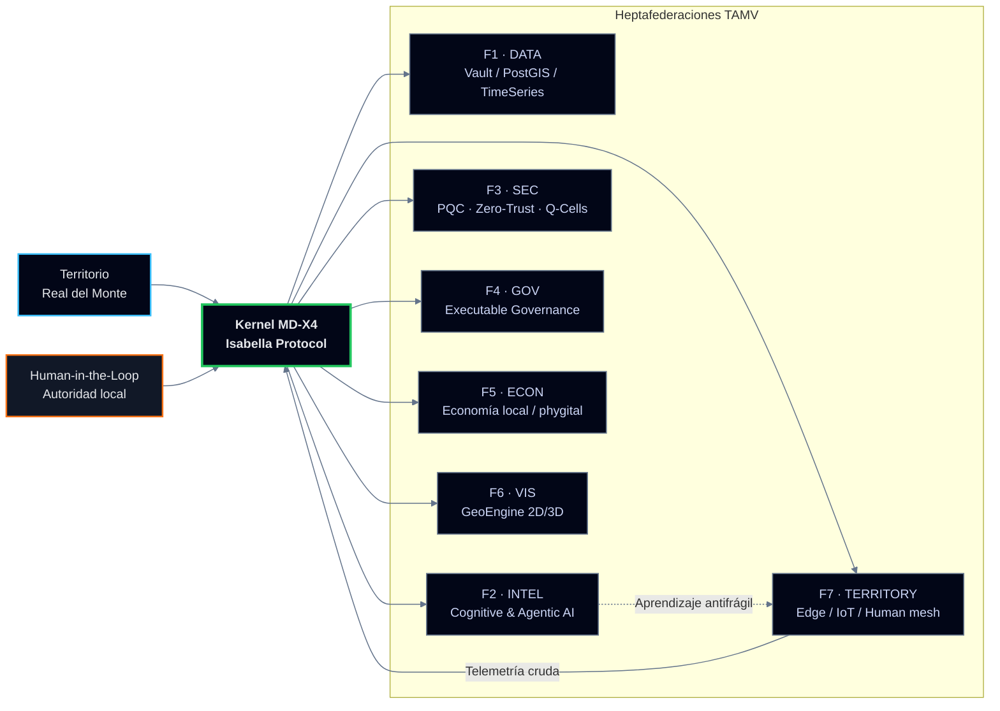

<!-- HERO: Crystal Morphoglass + Particles Banner -->

<div align="center">

<!-- Banner tipo particles (sustituye por tu asset real si quieres) -->


<br/><br/>

<h1 style="font-weight:700; letter-spacing:0.18em; text-transform:uppercase;">
TAMV ONLINE · ECOSISTEMA LATAM
</h1>
<h3 style="font-weight:400; color:#CBD5F5; margin-top:4px;">
RDM‑TOS · Sovereign Territorial Operating System · Crystal Morphoglass Edition
</h3>

<br/>


<br/><br/>

<div style="
  max-width:920px;
  padding:18px 26px;
  border-radius:22px;
  border:1px solid rgba(148,163,184,0.55);
  background:
    radial-gradient(circle at 0% 0%, rgba(56,189,248,0.18), transparent 55%),
    radial-gradient(circle at 100% 100%, rgba(244,63,94,0.13), transparent 55%),
    linear-gradient(145deg, rgba(15,23,42,0.96), rgba(15,23,42,0.92));
  backdrop-filter: blur(18px);
  box-shadow:
    0 28px 80px rgba(0,0,0,0.85),
    0 0 0 1px rgba(15,23,42,0.95);
  text-align:left;
">
<p style="color:#E5E7EB; font-size:14px; line-height:1.7;">
<strong style="color:#38BDF8;">TAMV ONLINE</strong> es un ecosistema civilizatorio federado,
nacido en México, que diseña infraestructura soberana e
<strong>Inteligencia Nativa Extensible</strong> para que territorios como Real del Monte operen
su propio sistema operativo digital, en lugar de ser solo datasets de terceros.
</p>
<p style="color:#9CA3AF; font-size:13px; margin-top:6px;">
Este README conecta mi trabajo como arquitecto (Anubis Villaseñor) con el Nodo Territorial
<em>RDM‑TOS</em>, el Canon Maestro de TAMV y el registro académico asociado (ORCID · DOI · OpenAIRE).
</p>
</div>

</div>

---

## 1. Quién soy

**Edwin Oswaldo Castillo Trejo · Anubis Villaseñor**  
CEO & Fundador de TAMV ONLINE · Arquitecto de la arquitectura MD‑X4 / MD‑X4 Quantum y del Modelo de las 7 Federaciones.[web:193][web:254]

- Ubicación: Mineral del Monte (Real del Monte), Hidalgo, México.  
- Trabajo en el cruce entre **infraestructura soberana**, IA aplicada y territorio inteligente.[web:229][web:232]  
- Mi producción técnica y conceptual está registrada en **ORCID** y vinculada vía **DOI** a Zenodo y OpenAIRE.[web:193]

**Perfiles oficiales:**

- 🌐 Sitio oficial TAMV: https://tamvonline-odoo.com  
- 📰 Blog técnico / narrativo: https://tamvonlinenetwork.blogspot.com  
- 🧬 ORCID: https://orcid.org/0009-0008-5050-1539  
- 🧾 DOI (Canon TAMV): https://doi.org/10.5281/zenodo.19436662  
- 🔗 LinkedIn: https://www.linkedin.com/in/edwin-oswaldo-castillo-aka-anubis-villaseñor-69a847376/  
- 👥 Comunidad técnica: https://groups.io/g/TAMVONLINE-ECOSISTEM-LATAM/topics  
- 🐙 GitHub: https://github.com/OsoPanda1  

---

## 2. Ecosistema TAMV · Vista ejecutiva

| Capa             | Rol en el ecosistema                                      | Ejemplos clave                                                      |
|------------------|-----------------------------------------------------------|---------------------------------------------------------------------|
| Infraestructura  | Cloud híbrida, dashboards MD‑X4/X5, seguridad Zero‑Trust | Nodo RDM‑TOS, monitoreo territorial, despliegue México–LATAM        |
| IA Nativa        | Kernel Isabella, agentes, moderación y auditoría         | Orquestación cognitiva y protocolos de soberanía algorítmica        |
| Territorio       | RDM‑TOS · Real del Monte como Nodo Cero                  | Gemelo digital, rutas, turismo, resiliencia urbana                  |
| Economía         | Marketplace phygital, economía circular local            | Artesanía, turismo, servicios territoriales soberanos               |
| Memoria          | BookPI, DIGYTAMV, Canon académico (ORCID/DOI/OpenAIRE)   | Registro de decisiones, código y publicaciones citables             |

---

## 3. Activity · GitHub signals

<div align="center">

<!-- Trophy -->
<a href="https://github.com/OsoPanda1">
  
</a>

<br/><br/>

<!-- Stats principales -->
<a href="https://github.com/OsoPanda1">
  
</a>
<a href="https://github.com/OsoPanda1">
  
</a>

<br/><br/>

<!-- Streak -->
<a href="https://git.io/streak-stats">
  
</a>

</div>

---

## 4. Núcleo técnico · RDM‑TOS & MD‑X4

### 4.1 Diagrama de arquitectura · Kernel territorial



### 4.2 Fragmento · RDM‑MAP‑2D (operación realmontense)

```ts
// frontend/rdm-map-2d.ts
import mapboxgl from "mapbox-gl";

mapboxgl.accessToken = process.env.MAPBOX_TOKEN ?? "";

const map = new mapboxgl.Map({
  container: "rdm-map-2d",
  style: "mapbox://styles/mapbox/dark-v11",
  center: [-98.667, 20.135], // Real del Monte
  zoom: 13.5,
  pitch: 45,
  bearing: -10,
});

map.on("load", () => {
  map.addSource("rdm-pois", {
    type: "geojson",
    data: "/vault/poi_nodes.json",
  });

  map.addLayer({
    id: "rdm-pois-layer",
    type: "circle",
    source: "rdm-pois",
    paint: {
      "circle-radius": 4,
      "circle-color": "#38BDF8",
      "circle-stroke-width": 1,
      "circle-stroke-color": "#020617",
    },
  });
});
```

---

## 5. Tech & Ecosystem · CyberNeon badges

<div align="center">


<br/>


</div>

---

## 6. Tema MarkDeck · CyberNeon + glassmorphism

Para presentaciones MD (MarkDeck / Slides MD), este tema mantiene coherencia con el README.

```yaml
# markdeck-theme-tamv-cyberneon.yaml
theme:
  name: "TAMV CyberNeon"
  fonts:
    base: "Inter, system-ui, -apple-system, BlinkMacSystemFont, sans-serif"
  colors:
    background: "#020617"
    foreground: "#E5E7EB"
    accentPrimary: "#38BDF8"
    accentSecondary: "#E11D48"
    accentTertiary: "#22C55E"
  layout:
    slide:
      padding: "2.5rem 3.5rem"
      borderRadius: "24px"
      shadow: "0 36px 90px rgba(0,0,0,0.9)"
      border: "1px solid rgba(148,163,184,0.45)"
      background: >
        radial-gradient(circle at 0% 0%, rgba(56,189,248,0.18), transparent 55%),
        radial-gradient(circle at 100% 100%, rgba(244,63,94,0.18), transparent 55%),
        linear-gradient(145deg, rgba(15,23,42,0.96), rgba(15,23,42,0.92))
  code:
    background: "#020617"
    borderRadius: "16px"
    fontSize: "0.9rem"
```

Uso en la presentación:

```markdown
::: card
# RDM‑TOS · Nodo Territorial

- Real del Monte como sistema crítico
- Kernel heptafederado MD‑X4
- IA nativa alineada al territorio
:::
```

---

## 7. Network & visitors

<div align="center">

<a href="https://tamvonline-odoo.com">
  
</a>
<a href="https://tamvonlinenetwork.blogspot.com">
  
</a>
<a href="https://orcid.org/0009-0008-5050-1539">
  
</a>
<a href="https://doi.org/10.5281/zenodo.19436662">
  
</a>
<a href="https://www.linkedin.com/in/edwin-oswaldo-castillo-aka-anubis-villaseñor-69a847376/">
  
</a>

<br/><br/>


</div>
