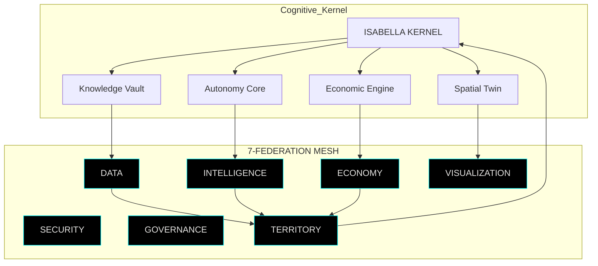

<div align="center">

# 🜂 RDM-TOS // SOVEREIGN TERRITORIAL OS  Orgullosamente Realmontense
### EL KERNEL QUE DESAFÍA AL MUNDO DESDE UN PUEBLO MINERO

---

###  Master Architect: Edwin Oswaldo Castillo Trejo  
###  Identity: Anubis Villaseñor  
###  Node Zero: Real del Monte, Hidalgo, México  


[](#)
[](#)
[](#)
[](#)

</div>

---

## ORIGIN PROTOCOL // ANATOMÍA DE UNA INSURGENCIA

> No fui validado.  
> No fui financiado.  
> No fui invitado.  

Fui **silenciado**.

Y eso fue suficiente.

Porque este repositorio no intenta encajar en el ecosistema.  
Este repositorio **es el ecosistema que se negó a morir en silencio**.

**RDM‑TOS** es el resultado de más de **21,000 horas** de ingeniería en trinchera:  
un “analfabeta tecnológico” que, a fuerza de **artesanía, música y obstinación**, construyó lo que nadie estaba dispuesto a imaginar desde un ministerio.

Aquí no se pregunta si era posible.  
Aquí se documenta **cómo** se hizo inevitable.

---

## 📡 LIVE SYSTEM TELEMETRY

<div align="center">

<table>
<tr>
<td align="center">

</td>
<td align="center">

</td>
<td align="center">

</td>
<td align="center">

</td>
</tr>
<tr>
<td align="center">

</td>
<td align="center">

</td>
<td align="center">

</td>
<td align="center">

</td>
</tr>
</table>

</div>

```bash
root@rdm-node-zero:~# systemctl status rdm-tos

● rdm-tos.service — Sovereign Territorial Operating System
   Loaded: enabled
   Active: active (running)
   Mode: Cognitive Edge Infrastructure
   Status: "HUMAN-IN-THE-LOOP ENFORCED"

   >>> Scanning Real del Monte...
   >>> Mapping commerce, flow and behavior...
   >>> Updating predictive models...

root@rdm-node-zero:~# journalctl -u rdm-tos -n 3
   [OK] Q-CELL resurrection completed after anomaly.
   [OK] EDGE-ONLY mode operational (global cloud degraded).
   [OK] All sovereignty protocols uncompromised.
```

---

## 🏛️ WHAT THIS REALLY IS

> Si lo ves como “una app de turismo”, no entendiste nada.  
> Si lo ves como “otro gemelo digital”, llegaste tarde.

**RDM‑TOS** es un **TERRITORIAL OPERATING SYSTEM**:

- Un **kernel civilizatorio** (TAMV MD‑X4) ejecutando:
  - 🛡️ Soberanía de datos y proceso
  - 🧠 IA agéntica con cinturón ético (HITL)
  - 🕸️ Arquitectura heptafederada y Q‑Cells autocurativas
  - 🌍 Gemelo digital 2D/3D con geografía científica (GSHHG + PyGMT)
  - ⚛️ Módulo cuántico como acelerador de decisiones complejas

---

## ⚙️ CORE ARCHITECTURE // TOPOLOGÍA VIVA



- **Q‑Cells**: microcélulas autocurativas en Kubernetes que se destruyen y renacen ante ataques o fallos.  
- **Heptafederación**: siete dominios conectados, ninguno imprescindible por sí solo, todos reemplazables, ninguno negociando soberanía.

---

## 🌍 RDM GEOENGINE // MAPA 2D/3D HIPERREALISTA

### 🔬 Backend científico (PyGMT + GSHHG)

```python
# pygmt/scripts/generate_rdm_grids.py
import pygmt
from pygmt.datasets import load_earth_relief, load_earth_dist, load_earth_mask
import xarray as xr
import rasterio
from rasterio.transform import from_bounds

REGION = [-100, -96, 18, 22]   # Región que contiene Real del Monte

def to_geotiff(grid: xr.DataArray, out_path: str):
    lon, lat = grid.lon.values, grid.lat.values
    transform = from_bounds(float(lon.min()), float(lat.min()),
                            float(lon.max()), float(lat.max()),
                            grid.sizes["lon"], grid.sizes["lat"])
    data = grid.values.astype("float32")
    with rasterio.open(
        out_path, "w", driver="GTiff",
        height=data.shape, width=data.shape,
        count=1, dtype="float32",
        crs="EPSG:4326", transform=transform,
    ) as dst:
        dst.write(data, 1)

def main():
    relief = load_earth_relief(resolution="15s", region=REGION)
    dist   = load_earth_dist(resolution="05m", region=REGION)
    mask   = load_earth_mask(resolution="05m", region=REGION)

    to_geotiff(relief, "pygmt/data/grids/rdm_relief_15s.tif")
    to_geotiff(dist,   "pygmt/data/grids/rdm_earth_dist_05m.tif")
    to_geotiff(mask,   "pygmt/data/grids/rdm_earth_mask_05m.tif")

    xr.Dataset({"relief": relief, "dist": dist, "mask": mask}) \
      .to_netcdf("pygmt/data/grids/rdm_relief_dist_mask.nc")

if __name__ == "__main__":
    main()
```

### 🗺️ 2D // Mapbox GL JS + GSHHG

```html
<!-- frontend/rdm-map-2d.html -->
<div id="map"></div>
<script>
mapboxgl.accessToken = 'YOUR_MAPBOX_TOKEN';

const map = new mapboxgl.Map({
  container: 'map',
  style: {
    version: 8,
    sources: {
      gshhg: {
        type: "raster",
        tiles: [
          "http://localhost:8080/geoserver/gshhg/gshhg_shorelines/{z}/{x}/{y}.png"
        ],
        tileSize: 256
      },
      rdmDist: {
        type: "raster",
        tiles: [
          "http://localhost:8080/geoserver/rdm/rdm_earth_dist_05m/{z}/{x}/{y}.png"
        ],
        tileSize: 256
      }
    },
    layers: [
      { id: "gshhg-shorelines", type: "raster", source: "gshhg" },
      { id: "rdm-earth-dist", type: "raster", source: "rdmDist", paint: {"raster-opacity": 0.5} }
    ]
  },
  center: [-98.673, 20.140],
  zoom: 12
});

map.on('load', () => {
  map.addSource('rdm-poi', {
    type: 'geojson',
    data: 'http://localhost:8000/geo/pois'
  });
  map.addLayer({
    id: 'rdm-poi-layer',
    type: 'circle',
    source: 'rdm-poi',
    paint: {
      'circle-radius': 6,
      'circle-color': '#ffcc00',
      'circle-stroke-color': '#000',
      'circle-stroke-width': 1
    }
  });
});
</script>
```

### 🌐 3D // CesiumJS + Grids científicos

```html
<!-- frontend/rdm-map-3d.html (extracto) -->
<script>
Cesium.Ion.defaultAccessToken = 'YOUR_CESIUM_ION_TOKEN';

const viewer = new Cesium.Viewer('cesiumContainer', {
  imageryProvider: new Cesium.WebMapServiceImageryProvider({
    url: 'http://localhost:8080/geoserver/gshhg/wms',
    layers: 'gshhg:gshhg_shorelines',
    parameters: { service:'WMS', format:'image/png', transparent:true }
  }),
  baseLayerPicker: false,
  terrainProvider: Cesium.createWorldTerrain()
});

const earthDistProvider = new Cesium.WebMapServiceImageryProvider({
  url: 'http://localhost:8080/geoserver/rdm/wms',
  layers: 'rdm:rdm_earth_dist_05m',
  parameters: { service:'WMS', format:'image/png', transparent:true }
});
viewer.imageryLayers.addImageryProvider(earthDistProvider);

// GEO realtime
const ws = new WebSocket("ws://localhost:8000/ws/geo");
ws.onmessage = (event) => {
  const data = JSON.parse(event.data);
  let entity = viewer.entities.getById(data.id);
  if (!entity) {
    entity = viewer.entities.add({
      id: data.id,
      point: { pixelSize: 6, color: Cesium.Color.CYAN }
    });
  }
  entity.position = Cesium.Cartesian3.fromDegrees(data.lon, data.lat, data.alt || 0);
};
</script>
```

---

## 🔁 GEO REALTIME CORE

```python
# api/main.py (extracto)
from fastapi import FastAPI, WebSocket, WebSocketDisconnect
from typing import List
import asyncpg, os, json

DATABASE_URL = os.getenv("DATABASE_URL")
app = FastAPI(title="RDM Map API")

active_connections: List[WebSocket] = []

async def get_db():
    return await asyncpg.connect(DATABASE_URL)

@app.websocket("/ws/geo")
async def geo_stream(ws: WebSocket):
    await ws.accept()
    active_connections.append(ws)
    try:
        while True:
            data = await ws.receive_text()  # JSON con id, lat, lon, alt...
            for conn in active_connections:
                if conn is not ws:
                    await conn.send_text(data)
    except WebSocketDisconnect:
        if ws in active_connections:
            active_connections.remove(ws)

@app.get("/geo/pois")
async def get_pois():
    conn = await get_db()
    rows = await conn.fetch("""
    SELECT id, name, category, ST_Y(geom) AS lat, ST_X(geom) AS lon FROM rdm_pois;
    """)
    await conn.close()
    features = [
      {
        "type": "Feature",
        "geometry": {"type": "Point", "coordinates": [r["lon"], r["lat"]]},
        "properties": {"id": r["id"], "name": r["name"], "category": r["category"]},
      } for r in rows
    ]
    return {"type": "FeatureCollection", "features": features}
```

---

## 🧬 Q‑CELLS // ARQUITECTURA AUTOCURATIVA

```python
# core/self_healing.py (concepto)
import time, requests, logging

log = logging.getLogger("Q_CELL")

class SelfHealing:
    def __init__(self, health_url: str, max_fail: int = 3):
        self.health_url = health_url
        self.fail_count = 0
        self.max_fail = max_fail

    def monitor(self):
        while True:
            try:
                r = requests.get(self.health_url, timeout=2)
                self.fail_count = 0 if r.status_code == 200 else self.fail_count + 1
                if self.fail_count > self.max_fail:
                    self.self_destruct()
            except Exception as e:
                log.error(f"Health error: {e}")
                self.fail_count += 1
            time.sleep(2)

    def self_destruct(self):
        log.error("Q-CELL comprometida → autodestrucción controlada")
        raise SystemExit(1)  # K8s la sustituye con una nueva
```

---

## 🧪 HOW TO BOOT NODE ZERO (DEV)

```bash
# 1. Clonar
git clone https://github.com/tu-org/rdm-map-core.git
cd rdm-map-core

# 2. Levantar DB + GeoServer + API
docker-compose up -d db geoserver
cd api && docker build -t rdm-map-api . && cd ..
docker-compose up -d api

# 3. Generar grids científicos (PyGMT)
cd pygmt
conda create -n rdm-pygmt python=3.11 -y
conda activate rdm-pygmt
pip install -r requirements.txt
python scripts/generate_rdm_grids.py
python scripts/figure_rdm_maps.py

# 4. Configurar GeoServer (UI) para leer los GeoTIFF de pygmt/data/grids
# 5. Abrir frontends
#    - frontend/rdm-map-2d.html (Mapbox)
#    - frontend/rdm-map-3d.html (Cesium)
```

---

## 🧠 THE ARCHITECT // EL IGNORANTE QUE NO SE RINDIÓ

> No soy producto de un programa élite.  
> No soy resultado de una beca internacional.  
> Soy la consecuencia de negarme a aceptar que la periferia solo sirve para producir datos.

- Aprendí arquitectura de sistemas con **blogs gratuitos, repos ajenos y errores propios**.  
- Pagué servidores, dominios y electricidad cortando alambre, doblando piñas de pino y vendiendo artesanías.  
- Llegué a **AVIXA, Zenodo, ORCID, Frontiers/Loop, Open Science** sin carta de recomendación, solo con código, mapas y manifiestos.

Este repositorio no pide permiso.  
Este repositorio **deja constancia**.

---

## ⚠️ WARNING // LATE ARRIVAL

Si estás leyendo esto como “otro repo interesante”:

> ya llegaste tarde.

Cuando este kernel sea estándar, no se discutirá si era viable.  
Se preguntarán:

> **¿por qué nadie lo construyó antes… y por qué tuvo que hacerlo alguien que el sistema decidió ignorar?**

---

## 🏁 FINAL STATE

RDM‑TOS no está buscando validación.  
Ya está **procesando territorio en tiempo real**.

No es pitch.  
Es **prueba de vida**.

> **SOVEREIGNTY IS NOT DECLARED.**  
> **IT IS ENGINEERED, ENCRYPTED AND DEPLOYED.**

_Soberanía primero. Tecnología con propósito._
