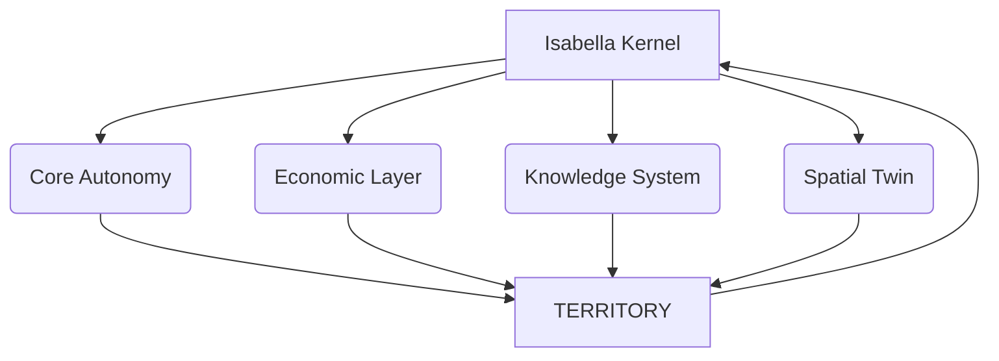

# 🜂 RDM-TOS  Orgullosamente Realmontense
## Sovereign Territorial Operating System  
### Real del Monte, Hidalgo — Node Zero

---

<div align="center">

###  Master Architect  
**Edwin Oswaldo Castillo Trejo**

###  System Identity  
**Anubis Villaseñor**

###  Research Identity  
ORCID: 0009-0008-5050-1539

---

**"Sovereignty is not declared. It is engineered."**

</div>

---

# MANIFEST

This is not a startup.  
This is not a smart city.  
This is not a software product.

## This is a new category:

#  TERRITORIAL OPERATING SYSTEM

A system designed to transform a territory into a **computational entity** capable of:

-  Executing sovereignty  
-  Operating its own economy  
-  Running governance as code  
-  Learning through territorial intelligence  
-  Simulating itself in real time  

---

#  SYSTEM STATE

> This repository does not expose source code.  
> It exposes the **operational state of a territory in execution.**

---

```bash
root@node-zero:~# systemctl status isabella-kernel

● isabella-kernel.service - Sovereign Intelligence Core
   Status: ACTIVE
   Mode: Predictive Governance
   Protocol: Dignity Enforcement
   Process: Monitoring Territorial Systems
````

---

# 🧬 CORE ARCHITECTURE

## 7-Federation Mesh



---

#  SYSTEM LAYERS

| Layer              | Function                 |
| ------------------ | ------------------------ |
| Perception Layer   | Sensors + human behavior |
| Persistence Layer  | Territorial ledger       |
| Intelligence Layer | Predictive AI            |
| Governance Layer   | Executable rules         |
| Economic Layer     | Autonomous transactions  |
| Spatial Layer      | Digital twin             |
| Interface Layer    | Human interaction        |

---

#  ACTIVE MODULES

| Module             | Description                 | Status       |
| ------------------ | --------------------------- | ------------ |
| Isabella Kernel    | Territorial AI Orchestrator | 🟢 ACTIVE    |
| 2DBD Ledger        | Economic persistence system | 🟣 SYNCED    |
| RDM Twin 4D        | Digital twin simulation     | 🔵 RENDERING |
| Explorer Interface | Human-territory interaction | ⚪ ONLINE     |

---

#  TERRITORY AS A SYSTEM

Modern civilization digitized:

* communication
* finance
* knowledge

But not the territory.

RDM-TOS introduces:

## The territory as a programmable system

Where:

**physical space becomes responsive to computational logic.**

---

# ⚙️ TECHNOLOGICAL FOUNDATION

* TypeScript
* Node.js
* React
* PostgreSQL
* Docker
* WebGL / GIS

But the stack is not the innovation.

## The architecture is.

---

#  CAPABILITIES

* Predictive tourism intelligence
* Autonomous local economy
* Governance as executable logic
* Real-time territorial simulation
* Human + environmental data integration

---

#  DEPLOYMENT MODEL

This system is not deployed.

It is **activated**.

---

## Activation Phases

1. Node Zero Initialization
2. Sensorial Layer Injection
3. Economic Layer Binding
4. AI Governance Boot
5. Territorial Synchronization
6. Federation Expansion

---

# 📍 NODE ZERO

**Real del Monte, Hidalgo**

This is not just a location.

It is:

## The first territory running as an operating system

---

#  WHY THIS EXISTS

Cities fail not because of lack of technology.

They fail because:

* systems are fragmented
* decisions are not executable
* data is not unified
* intelligence is not systemic

RDM-TOS resolves this by turning territory into:

## a system that observes, decides, and acts

---

# CURRENT STATUS

RDM-TOS is not a concept.

It is an **active architectural process.**

---

#  FINAL STATE

When mature, this system will not be seen as innovation.

It will be seen as:

## infrastructure

---

#  ARCHITECT

**Edwin Oswaldo Castillo Trejo**

An architect is not the one who uses technology.

An architect is the one who defines:

## what must exist before it exists

---

# 🜂 PHILOSOPHY

* No dependence on immediate validation
* No optimization for trends
* No compromise of structural coherence

Only:

## inevitability through execution

---

#  FUTURE

A network of territories operating as nodes:

* autonomous
* intelligent
* economically sovereign

## A computational civilization layer

---

# 🏁 CONCLUSION

This repository is not a project.

## It is evidence.

Evidence of a system being built before it is understood.

---

<div align="center">

### RDM-TOS

### Node Zero Active

</div>
```

---
