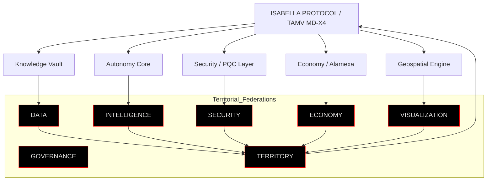

<div align="center">

# 🜂 RDM-TOS // TERRITORIAL OPERATING SYSTEM  
### UN KERNEL LEVANTADO A PULSO CONTRA TODO UN PAÍS DORMIDO

### ⚙️ Master Architect: Edwin Oswaldo Castillo Trejo  
### 🧬 Alias: Anubis Villaseñor  
### 🌋 Origen: Real del Monte, Hidalgo, México  


</div>

---

## 🩸 VERDAD INCÓMODA

No hubo incubadora.  
No hubo pitch.  
No hubo “mentores”.  

Hubo esto:

- Un país que presume “innovación” mientras firma contratos de dependencia.  
- Una burocracia que se toma selfies con Big Tech mientras entrega el mapa completo de su gente.  
- Un tipo, en un pueblo minero, que decidió que **no iba a pedir permiso para dejar de ser colonia**.

Este repositorio es el registro forense de esa decisión.

No es inspiracional.  
Es **un expediente técnico de desobediencia**.

---

## 🧠 QUÉ ES RDM-TOS (SIN MAQUILLAJE)

RDM‑TOS es:

- Un **SISTEMA OPERATIVO TERRITORIAL** que trata al pueblo como sistema crítico, no como destino turístico.
- Un **KERNEL DE SOBERANÍA COGNITIVA** que se niega a que tu territorio sea solo “input” de modelos ajenos.
- Una **ARQUITECTURA HEPTAFEDERADA ANTIFRÁGIL** diseñada para una realidad hostil:
  - ciberataques
  - colapso de nube
  - gobiernos cambiantes
  - indiferencia estructural

Si viniste buscando “otra app bonita”, salte.  
Aquí se habla de **infraestructura**, no de features.

---

## ⚙️ NÚCLEO: TAMV MD-X4



### Propiedades básicas:

- **Heptafederado**: nada es monolito, todo es reemplazable, nada está por encima del territorio.  
- **Q‑Cells autocurativas**: cuando algo falla, no se “parchea”: se destruye y se rehace más fuerte.  
- **Human‑In‑The‑Loop a la fuerza**: ninguna decisión crítica se ejecuta sin un humano identificado al mando.

---

## 🌍 RDM DIGITAL: EL PUEBLO COMO SISTEMA CRÍTICO

Real del Monte no es el fondo de un brochure.  
Es **NODE ZERO**.

- Cada pastes, hotel, taller y puesto callejero puede existir como nodo en el grafo vivo.  
- Cada flujo de turistas, rutas y riesgos se simula y se reescribe en tiempo real.  
- El territorio no solo se “mapea”: **se defiende, se optimiza y se recuerda**.

### 🌐 GEOENGINE 2D/3D // CRUDO, CIENTÍFICO Y SIN PNG DE STOCK

```python
# pygmt/scripts/generate_rdm_grids.py
import pygmt
from pygmt.datasets import load_earth_relief, load_earth_dist, load_earth_mask
import xarray as xr
import rasterio
from rasterio.transform import from_bounds

# El país no te va a cuidar: tú defines tu región.
REGION = [-100, -96, 18, 22]

def to_geotiff(grid: xr.DataArray, out_path: str) -> None:
    lon, lat = grid.lon.values, grid.lat.values
    transform = from_bounds(
        float(lon.min()), float(lat.min()),
        float(lon.max()), float(lat.max()),
        grid.sizes["lon"], grid.sizes["lat"],
    )
    data = grid.values.astype("float32")
    height, width = data.shape
    with rasterio.open(
        out_path,
        "w",
        driver="GTiff",
        height=height,
        width=width,
        count=1,
        dtype="float32",
        crs="EPSG:4326",
        transform=transform,
    ) as dst:
        dst.write(data, 1)

def main() -> None:
    # Relieve real del terreno, no wallpapers.
    relief = load_earth_relief(resolution="15s", region=REGION)
    # Distancia a costa derivada de GSHHG (para riesgos, accesibilidad, rutas).
    dist   = load_earth_dist(resolution="05m", region=REGION)
    # Máscara tierra/mar para no cometer el pecado de poner negocios en el mar.
    mask   = load_earth_mask(resolution="05m", region=REGION)

    to_geotiff(relief, "pygmt/data/grids/rdm_relief_15s.tif")
    to_geotiff(dist,   "pygmt/data/grids/rdm_earth_dist_05m.tif")
    to_geotiff(mask,   "pygmt/data/grids/rdm_earth_mask_05m.tif")

    xr.Dataset(
        {
            "relief": relief,
            "dist":   dist,
            "mask":   mask,
        }
    ).to_netcdf("pygmt/data/grids/rdm_relief_dist_mask.nc")

if __name__ == "__main__":
    main()
```

> Estos grids no son decoración.  
> Son la base dura para:

- 🛰️ Render Cesium 3D hiperrealista sobre relieve real  
- ⚠️ Capas de riesgo y proximidad (barrancas, pendientes, costa)  
- 🧭 Simulación de rutas y logística territorial con contexto físico real  
- 🧠 Decisiones que afectan a personas, comercios y vidas, no a “usuarios” abstractos  

## 📡 TELEMETRÍA EN TIEMPO REAL (SIN FILTRO)

```bash
root@rdm-node-zero:~# systemctl status rdm-tos

● rdm-tos.service — Territorial OS / Real del Monte
   Loaded: enabled
   Active: active (running)
   Status: "EDGE MODE: ON — GLOBAL CLOUD: OPTIONAL"

   >>> Ingestando señales de comercios locales
   >>> Trazando flujo de turistas
   >>> Ajustando rutas seguras en base a relieve y congestión
```

```python
# api/main.py (extracto brutal)
from fastapi import FastAPI, WebSocket, WebSocketDisconnect
import asyncpg, os

DATABASE_URL = os.getenv("DATABASE_URL")
app = FastAPI(title="RDM MAP / NODE ZERO")

active = []

@app.websocket("/ws/geo")
async def geo_stream(ws: WebSocket):
    await ws.accept()
    active.append(ws)
    try:
        while True:
            data = await ws.receive_text()
            # No hay vendor cloud aquí: lo que entra, se queda bajo control territorial.
            for conn in active:
                if conn is not ws:
                    await conn.send_text(data)
    except WebSocketDisconnect:
        if ws in active:
           active.remove(ws)
```

---

## 🔒 SEGURIDAD SIN DISCURSO: PQC + AUTODESTRUCCIÓN

No es “ciberseguridad de brochure”.  
Es:

- **Criptografía post‑cuántica** (CRYSTALS‑Kyber) para que cuando llegue el primer actor con máquina cuántica real, tu territorio no sea el primero en caer.  
- **Autodestrucción lógica** en Q‑Cells: si huele a compromiso, esa célula no pide permiso: **se mata y se regenera**.

```python
# core/self_healing.py (concepto)
class SelfHealing:
    def __init__(self, health_url: str, max_fail: int = 3):
        self.health_url = health_url
        self.fail = 0
        self.max_fail = max_fail

    def monitor(self):
        while True:
            ok = self._check()
            self.fail = 0 if ok else self.fail + 1
            if self.fail > self.max_fail:
                self.self_destruct()

    def _check(self) -> bool:
        # Aquí va un health real. Si falla, no se negocia.
        ...

    def self_destruct(self):
        # Aquí hay una decisión: o muere el pod, o muere la soberanía.
        raise SystemExit(1)
```

---

## 🩻 CÓMO SE LEVANTÓ TODO ESTO (SIN MITOLOGÍA)

No hubo:

- fondos
- grants
- VC
- “innovación abierta”

Hubo:

- **Artesanías el Rosario**: alambre, bonsáis, flores secas pagaron servidores, dominios y electricidad.  
- Música independiente escrita contra la ansiedad de ver a tu país entregarse.  
- Noches enteras reventando errores hasta que la arquitectura dejó de colapsar.

Cada commit es la respuesta a una sola pregunta:

> “¿Y si nadie viene a salvarte, lo construyes tú o aceptas ser colonia?”

El autor eligió la primera opción.  
Éste es el resultado.

---

## 🚨 SI ERES GOBIERNO, BANCO, BIG TECH O ACADEMIA

Este repositorio no te pide nada.  
Solo deja claro:

- Se puede levantar **infraestructura de clase mundial** sin ti.  
- Se puede tener **soberanía territorial real** sin tus contratos.  
- Se puede lograr **reconocimiento internacional** (AVIXA, Zenodo, ORCID, ciencia abierta) mientras tú sigues organizando paneles y PDFs.

Cuando llegues, no vengas a preguntar “cómo podemos apoyar”.  
La pregunta honesta será:

> “¿por qué nos tardamos tanto en tomar en serio algo que se escribió con sangre, alambre y 21,000 horas de obstinación?”

---

## 🧬 PARA QUIÉN SÍ ES ESTO

- Para quien se sabe **periferia** pero se rehúsa a ser **servicio**.  
- Para quien está dispuesto a escribir arquitectura aunque nadie le aplauda.  
- Para quien entiende que “soberanía digital” no es un término bonito en un paper, sino la diferencia entre **decidir tu destino** o ser un dataset más en la nube de otros.

---

## 🧱 HOW TO BOOTSTRAP TU PROPIA INSURGENCIA (DEV QUICKSTART)

```bash
# 1. Clonar el núcleo
git clone https://github.com/tu-org/rdm-tos.git
cd rdm-tos

# 2. Levantar PostGIS + GeoServer + API
docker-compose up -d db geoserver
cd api && docker build -t rdm-map-api . && cd ..
docker-compose up -d api

# 3. Generar grids científicos (PyGMT + GSHHG)
cd pygmt
conda create -n rdm-pygmt python=3.11 -y
conda activate rdm-pygmt
pip install -r requirements.txt
python scripts/generate_rdm_grids.py
python scripts/figure_rdm_maps.py

# 4. Configurar GeoServer para leer los GeoTIFF de pygmt/data/grids
# 5. Abrir:
#    - frontend/rdm-map-2d.html (Mapbox GL JS)
#    - frontend/rdm-map-3d.html (CesiumJS)
# 6. Conectar tus propios sensores / POIs / flujos a /ws/geo
```

---

##  EL ARQUITECTO (SIN MITO, SOLO CONTEXTO)

No soy “visionario” ni una mente brillante. 
Soy un orgulloso Realmontense, ¡Mexicano señores!
que se cansó de ver a su país regalarlo todo.

- Me dijeron que era tarde para aprender.  
- Me dijeron que sin aval institucional no iba a pasar nada.  
- Me dijeron que nadie iba a tomar en serio un kernel nacido de un puesto callejero de artesanías.

Tenían razón en algo:  
**para ellos**, era tarde.  
Para mí, era el único momento aceptable.

---

## ⚠️ CONCLUSIÓN (SIN DIPLOMACIA)

Este repo no busca agradar.  
Busca dejar registro.

> Cuando el mapa esté completo,  
> cuando otros territorios lo repliquen,  
> cuando la periferia empiece a hablar en código propio…  

no tendrá sentido preguntar si esto era demasiado ambicioso.

La única pregunta que importará será:

> **¿cuántas oportunidades más está dispuesto tu territorio a dejar pasar antes de darse cuenta de que nadie va a escribir su kernel por él?**

**Soberanía no es un discurso.  
Es un binario corriendo en tu propia máquina.**
```
