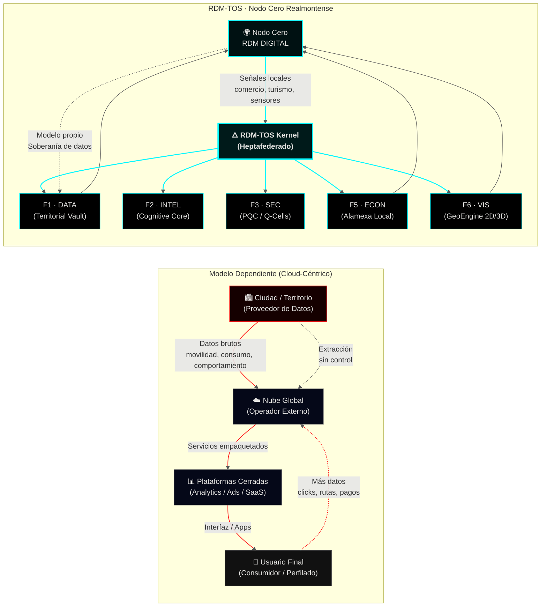
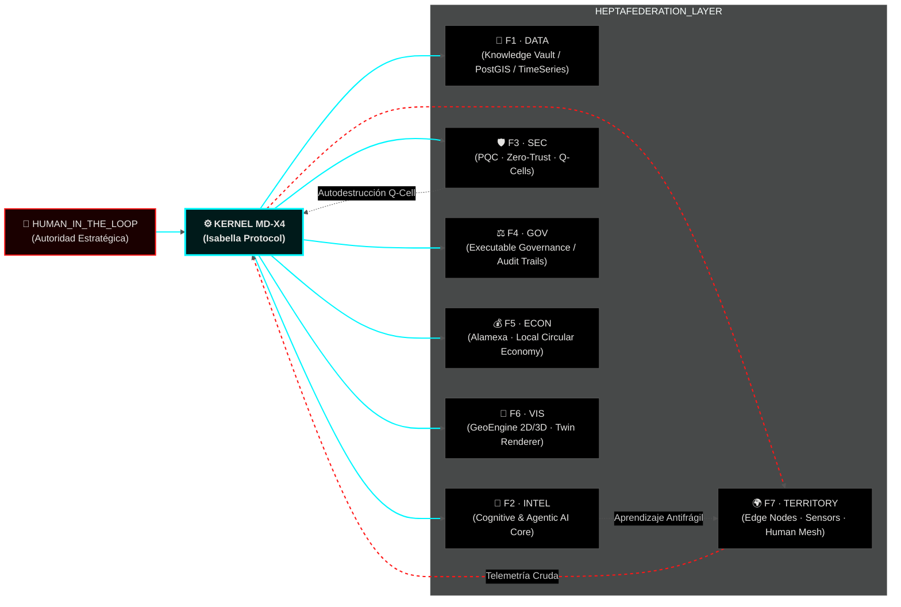
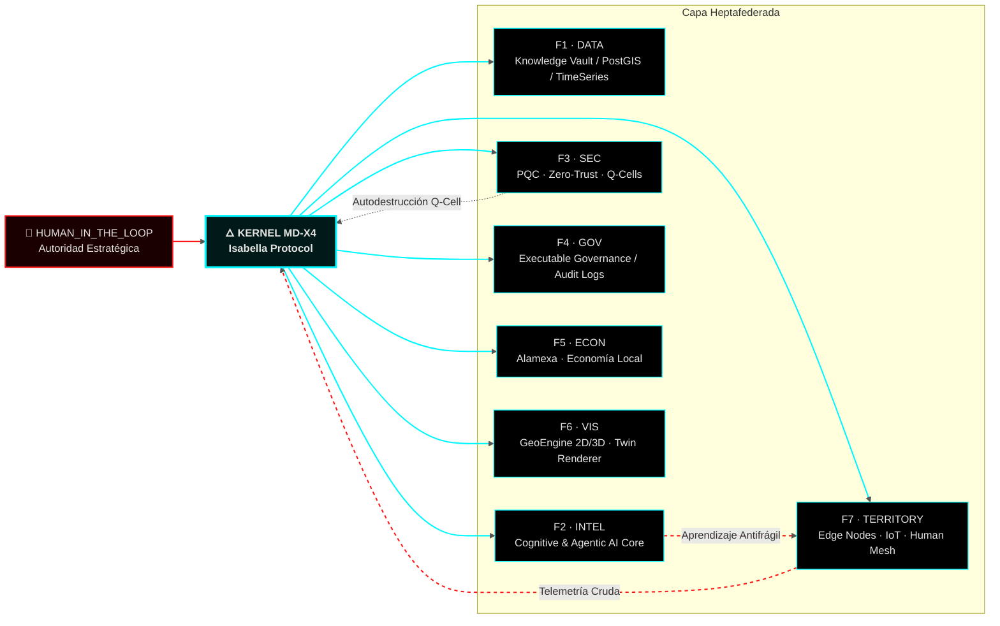

# 🜂 RDM‑TOS · Orgullosamente Realmontense  
## Sovereign Territorial Operating System

<div align="center">


</div>

---

<div align="center">


</div>

---

## 🩻 DIAGNÓSTICO DE RED // TOPOGRAFÍA DE LA DEPENDENCIA

<div align="center">


</div>

Latinoamérica fue convertida en **infraestructura cognitiva barata**: territorios que producen datos mientras el cómputo estratégico, la memoria y la decisión residen en nubes ajenas.  
En ese contexto, RDM‑TOS no es “innovación abierta”; es un **expediente de desobediencia tecnológica**.

RDM‑TOS nace en la periferia de un país dormido, financiado por artesanías de alambre y noches de insomnio, con una certeza brutal:  
**si no escribes tu propio kernel, eres el dataset de alguien más.**

No hubo incubadora. No hubo pitch. No hubo “mentores”.  
Hubo un arquitecto en un pueblo minero que decidió que **no iba a pedir permiso para dejar de ser colonia**.  
Este repositorio es el registro forense de esa decisión.

### 🩻 Topografía de la Dependencia · RDM vs Modelo Clásico


---

## 🧠 VISIÓN DE ARQUITECTURA · KERNEL HEPTAFEDERADO

RDM‑TOS abstrae el territorio físico como un **sistema crítico de alta disponibilidad**.  
No “mapeamos” un pueblo: **instanciamos el territorio en el ciberespacio**.

Es un **Kernel de Soberanía Cognitiva** que se niega a que tu territorio sea sólo “input” de modelos ajenos.

### 🔁 TAMV MD‑X4 · Diagrama de Soberanía

<div align="center">



</div>

**Propiedades estructurales:**

- **Heptafederado**: nada es monolito, todo es reemplazable, nada está por encima del territorio.  
- **Q‑Cells autocurativas**: ante fallo o compromiso, la célula se destruye y se regenera más fuerte.  
- **Human‑In‑The‑Loop reforzado**: ninguna decisión civilizatoria se ejecuta sin un humano identificado al mando.

---

## 🌍 RDM DIGITAL · EL PUEBLO COMO SISTEMA CRÍTICO

Real del Monte no es fondo de brochure: es **NODE ZERO**.

- Cada pastes, hotel, taller y puesto callejero puede existir como nodo en el grafo vivo.  
- Cada flujo de turistas, rutas y riesgos se simula y se reescribe en tiempo real.  
- El territorio no sólo se “mapea”: **se defiende, se optimiza y se recuerda**.

---

## 🌐 GEOENGINE 2D/3D · CRUDO, CIENTÍFICO Y SIN PNG DE STOCK

Este módulo ingesta DEMs de alta resolución y genera la base táctica del gemelo territorial.  
No hay wallpapers: hay **geofísica real** convertida en infraestructura.

```python
# pygmt/scripts/generate_tactic_grids.py
import pygmt
import xarray as xr
import rasterio
from rasterio.transform import from_bounds
from rdm_tos.core.config import REGION_ZERO, RESOLUTION_HIGH

def to_geotiff(grid: xr.DataArray, out_path: str) -> None:
    lon, lat = grid.lon.values, grid.lat.values
    transform = from_bounds(
        float(lon.min()), float(lat.min()),
        float(lon.max()), float(lat.max()),
        grid.sizes["lon"], grid.sizes["lat"],
    )
    data = grid.values.astype("float32")
    height, width = data.shape
    with rasterio.open(
        out_path,
        "w",
        driver="GTiff",
        height=height,
        width=width,
        count=1,
        dtype="float32",
        crs="EPSG:4326",
        transform=transform,
    ) as dst:
        dst.write(data, 1)

def generate_sovereignty_grids() -> None:
    """
    Ingesta relieve real, construye máscara de soberanía y calcula pendiente
    para simulación de rutas y análisis de riesgo.
    """
    print(f"🛰️ Instanciando grids para REGION_ZERO: {REGION_ZERO}")

    relief = pygmt.datasets.load_earth_relief(
        resolution=RESOLUTION_HIGH,
        region=REGION_ZERO,
        registration="gridline",
    )

    mask = pygmt.datasets.load_earth_mask(
        resolution=RESOLUTION_HIGH,
        region=REGION_ZERO,
    )

    slope = pygmt.grdgradient(
        grid=relief,
        radii="e15s",
        azimuth=0,
    )

    to_geotiff(relief, "pygmt/data/grids/rdm_relief_15s.tif")
    to_geotiff(slope,  "pygmt/data/grids/rdm_slope_15s.tif")

    ds = xr.Dataset({"relief": relief, "mask": mask, "slope": slope})
    ds.to_netcdf("pygmt/data/vault/rdm_tactic_base.nc")
    print("📂 Grids exportados al Knowledge Vault.")

if __name__ == "__main__":
    generate_sovereignty_grids()
```

---

#### RDM‑MAP‑2D · Cartografía Operativa (Mapbox GL JS)

```javascript
// frontend/rdm-map-2d.js
import mapboxgl from "mapbox-gl";

mapboxgl.accessToken = process.env.MAPBOX_TOKEN;

const map = new mapboxgl.Map({
  container: "rdm-map-2d",
  style: "mapbox://styles/mapbox/dark-v11",
  center: [-98.667, 20.135], // Real del Monte
  zoom: 13.5,
  pitch: 45,
  bearing: -10,
});

// Capa base: relieve sombreado
map.on("load", () => {
  map.addSource("rdm-dem", {
    type: "raster-dem",
    url: "mapbox://mapbox.terrain-rgb"
  });

  map.setTerrain({ source: "rdm-dem", exaggeration: 1.4 });

  // Nodos económicos locales (POIs del Vault territorial)
  map.addSource("rdm-pois", {
    type: "geojson",
    data: "/vault/poi_nodes.json"
  });

  map.addLayer({
    id: "rdm-pois-layer",
    type: "circle",
    source: "rdm-pois",
    paint: {
      "circle-radius": 4,
      "circle-color": "#00F7FF",
      "circle-stroke-width": 1,
      "circle-stroke-color": "#111111"
    }
  });
});
```

---

Estos artefactos son la base para:

- 🛰️ Render Cesium 3D hiperrealista  
- ⚠️ Capas de riesgo y accesibilidad  
- 🧭 Simulación logística y rutas críticas  
- 🧠 Decisiones que afectan a personas reales, no a “usuarios” abstractos  

---

## 📡 VISUALIZACIÓN · CESIUMJS 3D HIPERREALISTA

RDM‑TOS toma los grids científicos y los proyecta en un motor 3D en tiempo real.  
**El territorio se convierte en la interfaz.**

```javascript
// frontend/js/rdm_3d_engine.js
import * as Cesium from "cesium";
import { RDM_VAULT_ENDPOINT, NODE_ZERO_COORDS } from "./config";

// Visor de soberanía territorial
const viewer = new Cesium.Viewer("cesiumContainer", {
  terrainProvider: Cesium.createWorldTerrain(),
  baseLayerPicker: false,
  geocoder: false,
  animation: false,
  timeline: false,
});

// Aproximación táctica a Nodo Cero
viewer.camera.flyTo({
  destination: Cesium.Cartesian3.fromDegrees(
    NODE_ZERO_COORDS.lon,
    NODE_ZERO_COORDS.lat,
    2000
  ),
  orientation: {
    heading: Cesium.Math.toRadians(0),
    pitch: Cesium.Math.toRadians(-45),
    roll: 0,
  },
});

// Comercios locales como nodos económicos federados
Cesium.GeoJsonDataSource.load(
  `${RDM_VAULT_ENDPOINT}/poi_nodes.json`,
  {
    stroke: Cesium.Color.fromCssColorString("#00F7FF"),
    fill: Cesium.Color.fromCssColorString("#001A1A").withAlpha(0.5),
    strokeWidth: 2,
  }
).then(ds => viewer.dataSources.add(ds));
```

---

#### RDM‑MAP‑3D · Cabina de Mando Territorial (CesiumJS)

```javascript
// frontend/rdm-map-3d.js
import * as Cesium from "cesium";
import { RDM_VAULT_ENDPOINT, NODE_ZERO_COORDS } from "./config";

const viewer = new Cesium.Viewer("cesiumContainer", {
  terrainProvider: Cesium.createWorldTerrain(),
  baseLayerPicker: false,
  geocoder: false,
  animation: false,
  timeline: false,
});

// Aproximación táctica
viewer.camera.flyTo({
  destination: Cesium.Cartesian3.fromDegrees(
    NODE_ZERO_COORDS.lon,
    NODE_ZERO_COORDS.lat,
    2200
  ),
  orientation: {
    heading: Cesium.Math.toRadians(0),
    pitch: Cesium.Math.toRadians(-45),
    roll: 0
  }
});

// Ingesta de gemelo económico
Cesium.GeoJsonDataSource.load(
  `${RDM_VAULT_ENDPOINT}/poi_nodes.json`,
  {
    stroke: Cesium.Color.fromCssColorString("#00F7FF"),
    fill: Cesium.Color.fromCssColorString("#001A1A").withAlpha(0.6),
    strokeWidth: 2
  }
).then(ds => viewer.dataSources.add(ds));
```

---

## 📡 TELEMETRÍA EN TIEMPO REAL · SIN VENDOR CLOUD

```bash
root@rdm-node-zero:~# systemctl status rdm-tos

● rdm-tos.service — Territorial OS / Real del Monte
   Loaded: enabled
   Active: active (running)
   Status: "EDGE MODE: ON — GLOBAL CLOUD: OPTIONAL"

   >>> Ingestando señales de comercios locales
   >>> Trazando flujo de turistas
   >>> Ajustando rutas seguras en base a relieve y congestión
```

```python
# api/main.py (extracto)
from fastapi import FastAPI, WebSocket, WebSocketDisconnect
import asyncpg, os

DATABASE_URL = os.getenv("DATABASE_URL")
app = FastAPI(title="RDM MAP / NODE ZERO")

active = []

@app.websocket("/ws/geo")
async def geo_stream(ws: WebSocket):
    await ws.accept()
    active.append(ws)
    try:
        while True:
            data = await ws.receive_text()
            # Lo que entra aquí se queda bajo gobernanza territorial.
            for conn in active:
                if conn is not ws:
                    await conn.send_text(data)
    except WebSocketDisconnect:
        if ws in active:
            active.remove(ws)
```

---

## 🔒 F3 · SEGURIDAD POST‑CUÁNTICA (PQC)

Aquí no hay “ciberseguridad” de brochure.  
Hay **matemática autodestructiva**.

RDM‑TOS integra criptografía basada en redes (Lattice‑based), como esquemas tipo CRYSTALS‑Kyber, para resistir actores con capacidad cuántica.  
Si huele a compromiso, la célula no negocia: **se destruye y se regenera**.

```python
# core/security/pqc_layer.py (concepto táctico)
from pqcrypto.kem.kyber512 import generate_keypair, encrypt
from rdm_tos.core.exceptions import QCellCompromisedError
import time

class PQCSession:
    """
    Capa de Seguridad Post-Cuántica para comunicaciones entre federaciones.
    """
    def __init__(self, health_url: str, max_fail: int = 3):
        self.public_key, self._secret_key = generate_keypair()
        self.health_url = health_url
        self.fail = 0
        self.max_fail = max_fail

    def encrypt_payload(self, pk_receptor, payload: bytes):
        """
        Negocia un secreto compartido (KEM) y lo encadena a cifrado simétrico
        de alta robustez (p.ej. AES-GCM).
        """
        ciphertext, shared_secret = encrypt(pk_receptor)
        encrypted_payload = b"<encrypted_payload>"  # Placeholder conceptual
        return ciphertext, encrypted_payload

    def monitor_integrity(self):
        """
        Monitorea continuamente integridad; si excede umbrales de fallo,
        dispara autodestrucción lógica de la Q-Cell.
        """
        while True:
            ok = self._check_quantum_sniffing()
            self.fail = 0 if ok else self.fail + 1
            if self.fail > self.max_fail:
                self.self_destruct()
            time.sleep(1)

    def _check_quantum_sniffing(self) -> bool:
        # Health check real de bajo nivel (tráfico, latencias, patrones).
        return True

    def self_destruct(self):
        """Autodestrucción lógica: mejor muere el pod que la soberanía."""
        raise QCellCompromisedError("PROTOCOLO DE AUTODESTRUCCIÓN LÓGICA INICIADO")
```

---

## 🧱 CÓMO HACER BOOTSTRAP DE TU PROPIA INSURGENCIA (DEV QUICKSTART)

```bash
# ⚠️ No apto para script‑kiddies ni burócratas.
# Requiere mentalidad antifrágil.

# 1 ▸ Clonar el Kernel Heptafederado
git clone --recursive https://github.com/tu-org/rdm-tos.git
cd rdm-tos

# 2 ▸ Instanciar entorno antifrágil (Conda + Docker)
make bootstrap

# 3 ▸ Levantar PostGIS + GeoServer + API
docker-compose up -d db geoserver
cd api && docker build -t rdm-map-api . && cd ..
docker-compose up -d api

# 4 ▸ Generar base dura territorial (PyGMT + GSHHG)
cd pygmt
conda create -n rdm-pygmt python=3.11 -y
conda activate rdm-pygmt
pip install -r requirements.txt
python scripts/generate_tactic_grids.py
python scripts/figure_tactic_maps.py

# 5 ▸ Configurar GeoServer para leer GeoTIFF en pygmt/data/grids
# 6 ▸ Desplegar visor táctico y conectar sensores / POIs a /ws/geo
#    - frontend/rdm-map-2d.html  (Mapbox GL JS)
#    - frontend/rdm-map-3d.html  (CesiumJS)
```

---

## 🧬 EL ARQUITECTO · SIN MITO, SÓLO CONTEXTO

**Anubis Villaseñor** (Edwin Oswaldo Castillo Trejo).  
Artesano de alambre. Músico. Arquitecto de sistemas territoriales por obstinación.  
Un orgulloso realmontense, mexicano, que se cansó de ver a su país regalarlo todo.

No soy “visionario” ni prodigio.  
Me dijeron que era tarde para aprender, que sin aval institucional no iba a pasar nada.  
Tenían razón en algo: **para ellos**, era tarde.  
He invertido más de **21,000 horas** en escribir arquitectura para demostrar que **la periferia puede programar su propio destino**.

---

## 1️⃣ Diagrama Mermaid · Topografía de la Dependencia RDM
```markdown
### 🩻 Topografía de la Dependencia · RDM vs Modelo Clásico


```

***
## 2️⃣ Badges dinámicos Shields.io para RDM‑TOS Realmontense
Pega esto en la parte alta del README, debajo del título:

```markdown
<div align="center">


</div>
```

Si luego quieres badges realmente dinámicos (endpoint JSON con stats de RDM‑TOS), podemos montarlo en una API o GitHub Action usando `endpoint?url=...`.

 [github](https://github.com/marketplace/actions/dynamic-badges)

***
## 3️⃣ Expansión de módulos RDM 2D y 3D con código
### 🌐 Módulo RDM‑MAP‑2D · Cartografía Operativa
```markdown
#### RDM‑MAP‑2D · Cartografía Operativa (Mapbox GL JS)

```javascript
// frontend/rdm-map-2d.js
import mapboxgl from "mapbox-gl";

mapboxgl.accessToken = process.env.MAPBOX_TOKEN;

const map = new mapboxgl.Map({
  container: "rdm-map-2d",
  style: "mapbox://styles/mapbox/dark-v11",
  center: [-98.667, 20.135], // Real del Monte
  zoom: 13.5,
  pitch: 45,
  bearing: -10,
});

// Capa base: relieve sombreado
map.on("load", () => {
  map.addSource("rdm-dem", {
    type: "raster-dem",
    url: "mapbox://mapbox.terrain-rgb"
  });

  map.setTerrain({ source: "rdm-dem", exaggeration: 1.4 });

  // Nodos económicos locales (POIs del Vault territorial)
  map.addSource("rdm-pois", {
    type: "geojson",
    data: "/vault/poi_nodes.json"
  });

  map.addLayer({
    id: "rdm-pois-layer",
    type: "circle",
    source: "rdm-pois",
    paint: {
      "circle-radius": 4,
      "circle-color": "#00F7FF",
      "circle-stroke-width": 1,
      "circle-stroke-color": "#111111"
    }
  });
});
```
```
### 🛰️ Módulo RDM‑MAP‑3D · Cabina de Mando (CesiumJS)
```markdown
#### RDM‑MAP‑3D · Cabina de Mando Territorial (CesiumJS)

```javascript
// frontend/rdm-map-3d.js
import * as Cesium from "cesium";
import { RDM_VAULT_ENDPOINT, NODE_ZERO_COORDS } from "./config";

const viewer = new Cesium.Viewer("cesiumContainer", {
  terrainProvider: Cesium.createWorldTerrain(),
  baseLayerPicker: false,
  geocoder: false,
  animation: false,
  timeline: false,
});

// Aproximación táctica
viewer.camera.flyTo({
  destination: Cesium.Cartesian3.fromDegrees(
    NODE_ZERO_COORDS.lon,
    NODE_ZERO_COORDS.lat,
    2200
  ),
  orientation: {
    heading: Cesium.Math.toRadians(0),
    pitch: Cesium.Math.toRadians(-45),
    roll: 0
  }
});

// Ingesta de gemelo económico
Cesium.GeoJsonDataSource.load(
  `${RDM_VAULT_ENDPOINT}/poi_nodes.json`,
  {
    stroke: Cesium.Color.fromCssColorString("#00F7FF"),
    fill: Cesium.Color.fromCssColorString("#001A1A").withAlpha(0.6),
    strokeWidth: 2
  }
).then(ds => viewer.dataSources.add(ds));
```
```

***
## 4️⃣ Ciberdelitos concretos en el diagnóstico de red
Para integrar en tu sección de “Diagnóstico de red”, puedes añadir este bloque:

```markdown
### 🧨 Ciberdelitos y Riesgos Reales en la Topografía de la Dependencia

La dependencia de nubes y plataformas externas no es sólo un problema filosófico;  
es una **superficie de ataque directa** que ya se ha explotado en la región:

- **Ransomware a infraestructura pública:** campañas que cifran servidores municipales, registros civiles y plataformas de pago, dejando a ciudades completas operando “a ciegas”. [web:118]
- **Infostealers y fraude financiero:** kits como LummaC2 exfiltran credenciales de banca, billeteras y backends de gobierno, permitiendo desvío de fondos y robo de identidad a escala masiva. [web:118]
- **Intrusiones geopolíticas a gobiernos locales:** grupos vinculados a estados han vulnerado sistemas gubernamentales en la región para espionaje, manipulación de datos y preparación de operaciones híbridas. [web:54]

En este contexto, un territorio que delega todo su dato y lógica a infraestructuras externas  
no es “moderno”: es **un objetivo de alto valor** sin capacidad de respuesta propia.
```


***
## 5️⃣ Diagrama de Soberanía TAMV MD‑X4 · Mermaid avanzado
Versión avanzada, consistente con lo que ya tienes pero mejor estilizada y limpia:

```markdown
### 🔁 TAMV MD‑X4 · Kernel de Soberanía (Mermaid Avanzado)



## ⚠️ EJECUTANDO PARADIGMA FINAL

Este repo no busca agradar.  
Busca dejar registro.

> Cuando el mapa esté completo,  
> cuando otros territorios lo repliquen,  
> cuando la periferia empiece a hablar en código propio…

no tendrá sentido preguntar si esto era demasiado ambicioso.

La única pregunta que importará será:

> **¿cuántas oportunidades más va a dejar pasar tu territorio  
> antes de aceptar que nadie va a escribir su kernel por él?**

RDM‑TOS es el recordatorio de que, cuando la nube global falle o cuando el primer actor cuántico hostil decida mapear tu país,  
**habrá un punto en el mapa de Hidalgo que no podrán apagar.**

**Soberanía no es un eslogan.  
Es un binario corriendo en tu propia máquina.**
