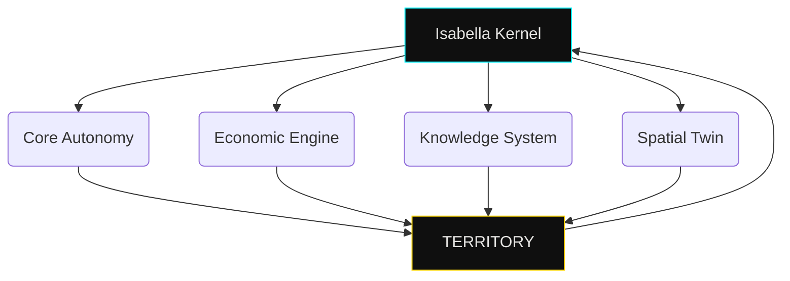

 ## RDM-TOS // SOVEREIGN TERRITORIAL OS:
**Orgullosamente Realmontenses, del estado de Hidalgo para el Mundo**

---

**Aunque hoy la comunidad mexicana me ignore, no estoy construyendo para la aprobación inmediata ni para el ruido del presente. Estoy dejando un registro, una estructura y una visión que trasciende este momento.**

**Lo que hago no depende de ser comprendido ahora.Depende de ser inevitable después**
**Mi legado no necesita validación:**
**quedará escrito en código, en sistemas y en territorio. Y cuando el tiempo alcance esta visión,**
**no preguntarán si fui escuchado… sino por qué no lo vieron venir.**

---


<div align="center">

# 🏛️ RDM-TOS // SOVEREIGN TERRITORIAL OPERATING SYSTEM

### ⚙️ Master Architect: Edwin Oswaldo Castillo Trejo  
### 🧬 Alias: Anubis Villaseñor | ORCID: 0009-0008-5050-1539  


</div>

---

# 📡 LIVE TERRITORIAL TELEMETRY

> ⚠️ Este repositorio no muestra código.  
> Expone el **estado operativo de un territorio en ejecución.**

<table align="center" width="100%">
<tr>
<td align="center">


</td>
<td align="center">


</td>
<td align="center">


</td>
<td align="center">


</td>
</tr>
</table>

---

[root@rdm-tos /node-zero]# systemctl status isabella-kernel

● isabella-kernel.service - Sovereign Intelligence Core
   Loaded: enabled
   Active: active (running)
   Since: 2026-03-24 00:00:00 CST
   Status: "DIGNITY PROTOCOL ENFORCED"
   Process: Monitoring Territory Nodes...
   Mode: Predictive Governance

---

# 🧠 SYSTEM MANIFEST

Esto no es una app.
Esto no es una startup.

Es una nueva categoría:

## ⚙️ TERRITORIAL OPERATING SYSTEM

Un sistema diseñado para ejecutar:

* 🛡️ **Soberanía Digital**
* 🪙 **Economía Autónoma**
* 📜 **Gobernanza Ejecutable**
* 👁️ **Inteligencia Territorial Predictiva**

---

# ⚙️ CORE ARCHITECTURE — 7 FEDERATION MESH



---

# 🧬 ACTIVE SYSTEM MODULES

<table align="center" width="100%">
<tr>
<th>Módulo</th>
<th>Función</th>
<th>Estado</th>
</tr>

<tr>
<td><b>Isabella Core</b></td>
<td>Orquestación de IA Territorial</td>
<td>🟢 ACTIVE</td>
</tr>

<tr>
<td><b>2DBD Ledger</b></td>
<td>Persistencia y Directorio Económico</td>
<td>🟣 SYNCED</td>
</tr>

<tr>
<td><b>RDM Twin 4D</b></td>
<td>Gemelo Digital del Territorio</td>
<td>🔵 RENDERING</td>
</tr>

<tr>
<td><b>Elevated Interface</b></td>
<td>Realidad Aumentada / Historia</td>
<td>🟠 ARMED</td>
</tr>

<tr>
<td><b>Explorer UI</b></td>
<td>Interfaz del Usuario / Turista</td>
<td>⚪ ONLINE</td>
</tr>

</table>

---

# 🛠️ SOVEREIGN TECH STACK

<div align="center">


</div>

---

# 🧠 SYSTEM CAPABILITIES

| Capacidad      | Descripción                      |
| -------------- | -------------------------------- |
| IA Territorial | Predicción de flujo turístico    |
| Economía Local | Transacciones sin intermediarios |
| Gobernanza     | Reglas ejecutables en código     |
| Digital Twin   | Simulación urbana en tiempo real |
| Data Layer     | Sensores + comportamiento humano |

---

# 📊 ARCHITECT INTELLIGENCE

<div align="center">


</div>

---

# ⚔️ DEPLOYMENT PHILOSOPHY

No se despliega software.
Se activa infraestructura viva.

### Fases:

1. Node Zero Activation
2. Sensorial Layer Injection
3. Economic Layer Binding
4. AI Governance Boot
5. Territorial Synchronization

---

# 🚨 FINAL STATE

> Este repositorio no representa un proyecto.

Representa:

## ⚙️ UN TERRITORIO EJECUTÁNDOSE COMO SISTEMA OPERATIVO

---

<div align="center">

### "Sovereignty is not claimed. It is engineered."


</div>
```

---
