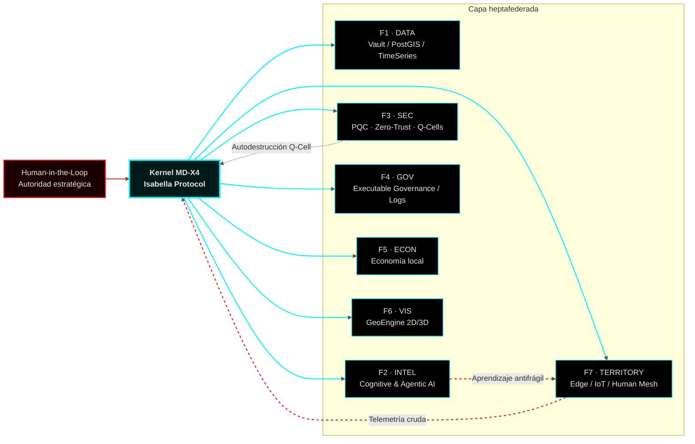

# RDM‑TOS · Sovereign Territorial Operating System  
## Nodo Cero · Orgullosamente Realmontense

Real del Monte, Hidalgo, México — primer nodo territorial del Ecosistema TAMV ONLINE.

---

## 1. Estado del Nodo

<div align="center">


</div>

---

## 2. Declaración de propósito

Latinoamérica ha sido tratada como **infraestructura cognitiva barata**: producimos datos mientras el cómputo, la memoria y la decisión viven en nubes ajenas.  
**RDM‑TOS** nace para romper ese patrón: no es una app, es un sistema operativo territorial que coloca al territorio como sujeto, no como dataset.

Principios:

- El territorio no es un “mercado”, es un **sistema crítico**.  
- Si no escribes tu propio kernel, **eres el dataset de alguien más**.  
- La soberanía no se reclama en discursos, se implementa en código y en topología.

Este repositorio es el registro técnico de esa decisión.

---

## 3. Diagnóstico de red · Topografía de la dependencia

### 3.1 Modelo dependiente vs Nodo soberano


---

## 4. Visión de arquitectura · Kernel heptafederado MD‑X4

RDM‑TOS abstrae el territorio como un **sistema de alta disponibilidad**, gobernado por un kernel que coordina 7 federaciones (datos, IA, seguridad, gobernanza, economía, visualización, territorio).



Propiedades clave:

- Heptafederado: nada es monolito, todo es reemplazable.  
- Human‑in‑the‑loop: decisiones civilizatorias siempre tienen responsable humano identificado.  
- Q‑Cells: ante compromiso, la célula se destruye y se regenera; mejor perder un pod que la soberanía.

---

## 5. Módulos de mapa · 2D y 3D

### 5.1 RDM‑MAP‑2D · Cartografía operativa (Mapbox GL JS)

```javascript
// frontend/rdm-map-2d.js
import mapboxgl from "mapbox-gl";

mapboxgl.accessToken = process.env.MAPBOX_TOKEN;

const map = new mapboxgl.Map({
  container: "rdm-map-2d",
  style: "mapbox://styles/mapbox/dark-v11",
  center: [-98.667, 20.135], // Real del Monte
  zoom: 13.5,
  pitch: 45,
  bearing: -10,
});

map.on("load", () => {
  map.addSource("rdm-dem", {
    type: "raster-dem",
    url: "mapbox://mapbox.terrain-rgb",
  });

  map.setTerrain({ source: "rdm-dem", exaggeration: 1.4 });

  map.addSource("rdm-pois", {
    type: "geojson",
    data: "/vault/poi_nodes.json",
  });

  map.addLayer({
    id: "rdm-pois-layer",
    type: "circle",
    source: "rdm-pois",
    paint: {
      "circle-radius": 4,
      "circle-color": "#00F7FF",
      "circle-stroke-width": 1,
      "circle-stroke-color": "#111111",
    },
  });
});
```

### 5.2 RDM‑MAP‑3D · Cabina de mando territorial (CesiumJS)

```javascript
// frontend/rdm-map-3d.js
import * as Cesium from "cesium";
import { RDM_VAULT_ENDPOINT, NODE_ZERO_COORDS } from "./config";

const viewer = new Cesium.Viewer("cesiumContainer", {
  terrainProvider: Cesium.createWorldTerrain(),
  baseLayerPicker: false,
  geocoder: false,
  animation: false,
  timeline: false,
});

viewer.camera.flyTo({
  destination: Cesium.Cartesian3.fromDegrees(
    NODE_ZERO_COORDS.lon,
    NODE_ZERO_COORDS.lat,
    2200
  ),
  orientation: {
    heading: Cesium.Math.toRadians(0),
    pitch: Cesium.Math.toRadians(-45),
    roll: 0,
  },
});

Cesium.GeoJsonDataSource.load(
  `${RDM_VAULT_ENDPOINT}/poi_nodes.json`,
  {
    stroke: Cesium.Color.fromCssColorString("#00F7FF"),
    fill: Cesium.Color.fromCssColorString("#001A1A").withAlpha(0.6),
    strokeWidth: 2,
  }
).then((ds) => viewer.dataSources.add(ds));
```

---

## 6. Base geofísica · PyGMT y grids tácticos

```python
# pygmt/scripts/generate_tactic_grids.py
import pygmt
import xarray as xr
import rasterio
from rasterio.transform import from_bounds
from rdm_tos.core.config import REGION_ZERO, RESOLUTION_HIGH

def to_geotiff(grid: xr.DataArray, out_path: str) -> None:
    lon, lat = grid.lon.values, grid.lat.values
    transform = from_bounds(
        float(lon.min()), float(lat.min()),
        float(lon.max()), float(lat.max()),
        grid.sizes["lon"], grid.sizes["lat"],
    )
    data = grid.values.astype("float32")
    height, width = data.shape
    with rasterio.open(
        out_path,
        "w",
        driver="GTiff",
        height=height,
        width=width,
        count=1,
        dtype="float32",
        crs="EPSG:4326",
        transform=transform,
    ) as dst:
        dst.write(data, 1)

def generate_sovereignty_grids() -> None:
    relief = pygmt.datasets.load_earth_relief(
        resolution=RESOLUTION_HIGH,
        region=REGION_ZERO,
        registration="gridline",
    )

    mask = pygmt.datasets.load_earth_mask(
        resolution=RESOLUTION_HIGH,
        region=REGION_ZERO,
    )

    slope = pygmt.grdgradient(
        grid=relief,
        radii="e15s",
        azimuth=0,
    )

    to_geotiff(relief, "pygmt/data/grids/rdm_relief_15s.tif")
    to_geotiff(slope,  "pygmt/data/grids/rdm_slope_15s.tif")

    ds = xr.Dataset({"relief": relief, "mask": mask, "slope": slope})
    ds.to_netcdf("pygmt/data/vault/rdm_tactic_base.nc")

if __name__ == "__main__":
    generate_sovereignty_grids()
```

---

## 7. Capa de seguridad · PQC y Q‑Cells

```python
# core/security/pqc_layer.py
from pqcrypto.kem.kyber512 import generate_keypair, encrypt
from rdm_tos.core.exceptions import QCellCompromisedError
import time

class PQCSession:
    def __init__(self, health_url: str, max_fail: int = 3):
        self.public_key, self._secret_key = generate_keypair()
        self.health_url = health_url
        self.fail = 0
        self.max_fail = max_fail

    def encrypt_payload(self, pk_receptor, payload: bytes):
        ciphertext, shared_secret = encrypt(pk_receptor)
        encrypted_payload = b"<encrypted_payload>"  # placeholder conceptual
        return ciphertext, encrypted_payload

    def monitor_integrity(self):
        while True:
            ok = self._check_quantum_sniffing()
            self.fail = 0 if ok else self.fail + 1
            if self.fail > self.max_fail:
                self.self_destruct()
            time.sleep(1)

    def _check_quantum_sniffing(self) -> bool:
        return True

    def self_destruct(self):
        raise QCellCompromisedError("Autodestrucción lógica de Q‑Cell iniciada")
```

---

## 8. Quickstart técnico

```bash
# 1. Clonar
git clone --recursive https://github.com/tu-org/rdm-tos.git
cd rdm-tos

# 2. Infra base (DB + GeoServer + API)
docker-compose up -d db geoserver
cd api && docker build -t rdm-map-api . && cd ..
docker-compose up -d api

# 3. Generar grids tácticos
cd pygmt
conda create -n rdm-pygmt python=3.11 -y
conda activate rdm-pygmt
pip install -r requirements.txt
python scripts/generate_tactic_grids.py

# 4. Levantar front 2D / 3D y conectar a /ws/geo
```

---

## 9. El arquitecto

**Anubis Villaseñor** (Edwin Oswaldo Castillo Trejo).  
Artesanía, música y arquitectura de sistemas se cruzan en un punto muy simple:  
**no delegar el destino del territorio a alguien que no vive en él.**

RDM‑TOS es una primera prueba: un pueblo minero que decide no comportarse como colonia digital.

> Soberanía no es un lema.  
> Es un kernel corriendo en tu propia máquina.
